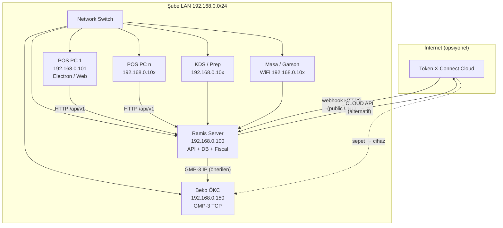
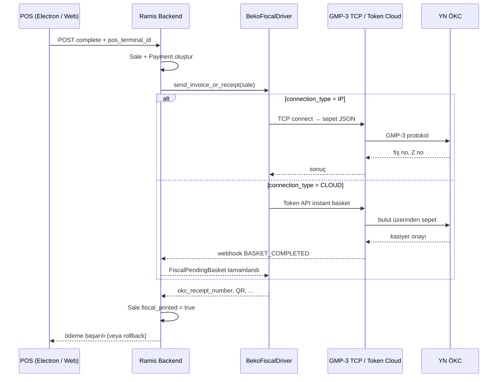
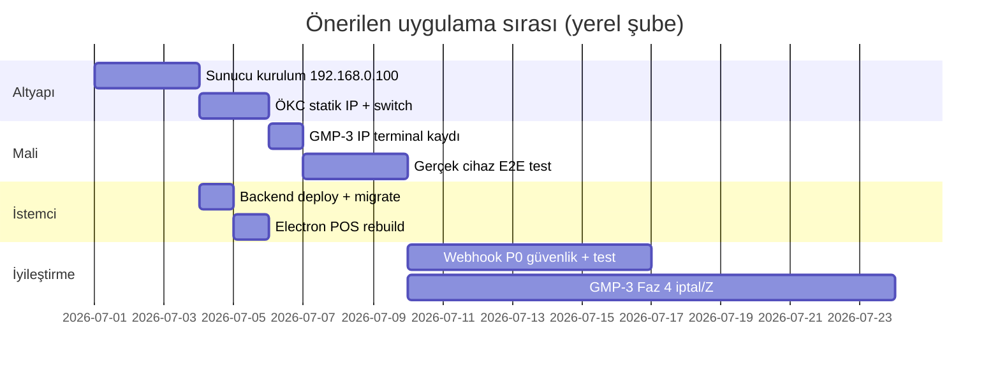

# Beko ÖKC / Mali Entegrasyon — Toplu Plan ve İdeal Ağ Topolojisi

> **Oluşturulma:** 2026-06-26  
> **Amaç:** Bu konuşma boyunca ele alınan mali entegrasyon (Token X-Connect Cloud, GMP-3 TCP/IP, webhook, Electron POS, yerel şube LAN) kararlarının **tek referans belgesi**.  
> **Hedef mimari:** Tek şube, yerel Ramis sunucusu `192.168.0.100`, switch üzerinden POS / KDS / mobil istemciler.

**Detay belgeler:**

| Belge | İçerik |
|-------|--------|
| [fiscal-local-lan-deployment.md](./fiscal-local-lan-deployment.md) | LAN yerleşimi, checklist |
| [fiscal-webhook-roadmap.md](./fiscal-webhook-roadmap.md) | Webhook MVP sonrası iş paketleri |
| [gmp3-tcpip-roadmap.md](./gmp3-tcpip-roadmap.md) | GMP-3 kod fazları |
| [docs/wiki/Fiscal_Integration.md](../wiki/Fiscal_Integration.md) | Mimari wiki |
| [docs/wiki/Fiscal_Integration_Production.md](../wiki/Fiscal_Integration_Production.md) | Prod kurulum (CLOUD) |

---

## 1. Yönetici özeti

Ramis ERP’de Beko YN ÖKC entegrasyonu **sürücü tabanlı** çalışır: ödeme tamamlanınca backend mali cihazı tetikler; başarısızsa satış **rollback** olur.

**Sizin planlanan topoloji (yerel sunucu, public IP yok) için ideal seçim:**

| Öncelik | Bağlantı türü | Gerekçe |
|---------|---------------|---------|
| **1 (önerilen)** | **GMP-3 TCP/IP** | Sunucu ve ÖKC aynı LAN’da; internet/webhook şart değil |
| 2 | Token X-Connect **CLOUD** | Webhook için public HTTPS veya port forward gerekir |
| — | USB/COM (SERIAL) | **Henüz desteklenmiyor** |

**Kod durumu (2026-06-26):**

- CLOUD + webhook **MVP tamam** (hibrit model: HTTP isteğinde 120 sn webhook bekleme + polling fallback)
- GMP-3 TCP/IP **Faz 1–3 tamam** (gerçek cihaz testi operasyonel adım)
- Electron POS: **ek kod gerekmez**; backend deploy + Electron yeniden build yeterli

---

## 2. İdeal ağ topolojisi (tam diyagram)

### 2.1 Şube fiziksel / IP planı

```text
                        [ İnternet ]
                             |
              (yalnızca CLOUD + Token webhook için;
               yerel şube GMP-3 IP'de zorunlu değil)
                             |
              ┌──────────────┴──────────────┐
              │   Token X-Connect Cloud      │  ← CLOUD modu
              └──────────────┬──────────────┘
                             │ HTTPS webhook (public URL gerekir)
                             ▼
┌────────────────────────────────────────────────────────────────────────────┐
│  Yerel ağ: 192.168.0.0/24                                                  │
│  Switch (kablolu + kablosuz)                                               │
│                                                                            │
│  ┌─────────────────────────────────────────────────────────────────────┐  │
│  │ RAMIS SERVER — 192.168.0.100                                        │  │
│  │  • nginx / Uvicorn / Daphne                                         │  │
│  │  • PostgreSQL, Redis                                                │  │
│  │  • Mali sürücüler (Beko CLOUD / GMP-3 IP)                           │  │
│  │  • Webhook endpoint (CLOUD): /api/v1/sales/fiscal/webhook/{uuid}/   │  │
│  └───────────────┬───────────────────────────────┬─────────────────────┘  │
│                  │ HTTP/WS                        │ TCP GMP-3 :1111/8080   │
│                  │                                ▼                        │
│  ┌───────────────┼───────────────┐    ┌─────────────────────┐            │
│  │ POS PC 1      │ POS PC 2 …    │    │ ÖKC / Beko          │            │
│  │ .101          │ .102+         │    │ 192.168.0.150       │            │
│  │ Electron/web  │               │    │ (Ethernet, statik IP)│            │
│  └───────────────┘               │    └─────────────────────┘            │
│                                  │                                         │
│  ┌───────────────┐  ┌────────────┴──┐  ┌─────────────────────────────┐   │
│  │ KDS PC        │  │ Prep Screen PC │  │ WiFi: masa mobil / garson   │   │
│  │ .10x          │  │ .10x           │  │ smart_table, waiter app     │   │
│  │ Electron/web  │  │                │  │ .10x — mali katman yok      │   │
│  └───────────────┘  └────────────────┘  └─────────────────────────────┘   │
└────────────────────────────────────────────────────────────────────────────┘
```

### 2.2 Mermaid — önerilen IP ataması



### 2.3 Önerilen statik IP tablosu

| Cihaz | Örnek IP | Port / not |
|-------|----------|------------|
| Ramis Server | `192.168.0.100` | 80/443 → nginx |
| POS PC 1 | `192.168.0.101` | `apiUrl` → sunucu |
| POS PC 2+ | `192.168.0.102+` | |
| **ÖKC Beko** | `192.168.0.150` | GMP-3: `1111` veya `8080` |
| KDS / Prep | `192.168.0.110+` | |
| Mobil / garson | DHCP veya `.120+` | Mali işlem yok |

---

## 3. Mali entegrasyon yazılım katmanı



**Kritik kural:** Mali işlem başarısız → `OrderValidationError` → transaction **rollback** (satış kaydı oluşmaz).

---

## 4. Bağlantı türü karar matrisi

| | GMP-3 TCP/IP | Token CLOUD | USB/COM SERIAL |
|---|:---:|:---:|:---:|
| Yerel sunucu `192.168.0.100`, public IP yok | ✅ **İdeal** | ⚠️ Webhook sorunu | ❌ |
| ÖKC Ethernet ile switch’te | ✅ | ✅ | — |
| ÖKC sadece USB, POS PC’de | — | ✅ | ❌ (planlanmadı) |
| Electron ek kodu | Gerekmez | Gerekmez | Gerekmez |
| Bağlantıyı kim açar | **Sunucu** → ÖKC IP | Sunucu → Token API | — |
| Webhook / public URL | Gerekmez | **Gerekir** | — |
| Kod durumu | ✅ Uygulandı | ✅ MVP | ❌ Hata mesajı |

---

## 5. Tamamlanan işler (kod + doküman)

### 5.1 Token X-Connect Cloud (webhook MVP)

| Bileşen | Konum |
|---------|--------|
| Webhook endpoint | `POST /api/v1/sales/fiscal/webhook/<terminal_uuid>/` |
| İşleme servisi | `backend/apps/sales/fiscal/webhook_service.py` |
| Bekleyen sepet | `FiscalPendingBasket` model + migration `0017` |
| Hibrit bekleme | 120 sn DB poll + polling fallback |
| Env | `FISCAL_WEBHOOK_BASE_URL` — install/update/ramis_settings |
| Admin UI | Webhook URL (`FiscalSettingsForm`), iki sütunlu POS modal |
| Testler | `TestFiscalWebhook` (+ driver testleri) |
| Prod rehberi | `docs/wiki/Fiscal_Integration_Production.md` |

**Ödeme modeli:** Senkron hibrit (A) — kasiyer overlay’de bekler; HTTP isteği mali işlem bitene kadar açık.

### 5.2 GMP-3 TCP/IP

| Bileşen | Konum |
|---------|--------|
| Protokol istemcisi | `backend/apps/sales/fiscal/gmp3_client.py` |
| Sepet oluşturma | `backend/apps/sales/fiscal/gmp3_basket.py` |
| Wired sürücü | `backend/apps/sales/fiscal/gmp3_wired_driver.py` |
| Beko yönlendirme | `beko_driver.py`: `IP` → wired; `CLOUD` → Token; `SERIAL` → hata |
| Testler | `TestGMP3Protocol` (27 fiscal test toplamı) |

### 5.3 Frontend / operasyon

| Bileşen | Durum |
|---------|--------|
| POS ödeme + `pos_terminal_id` | Mevcut |
| Mali overlay (“Mali İşlem Yapılıyor”) | Mevcut |
| Admin: IP / CLOUD / SERIAL form alanları | Mevcut |
| Electron POS | Bundled frontend; ek fiscal kodu yok |

---

## 6. Yapılacak işler (öncelik sırasıyla)

### 6.1 Operasyonel (kod dışı — canlıya alma)

**GMP-3 IP (önerilen yol):**

- [ ] ÖKC’ye statik IP (`192.168.0.150`), port doğrulama
- [ ] Sunucudan TCP test: `nc -zv 192.168.0.150 1111`
- [ ] Admin: terminal → Beko GMP3 → **Ağ (TCP/IP)** → IP + port + seri no
- [ ] Gerçek cihazla uçtan uca ödeme testi
- [ ] Backend deploy + migration; Electron POS yeniden build

**CLOUD (alternatif):**

- [ ] Public HTTPS + `FISCAL_WEBHOOK_BASE_URL` (`.100` LAN IP yetmez)
- [ ] Token Set Client Settings — webhook URL kaydı
- [ ] Prod Client ID/Secret/API URL
- [ ] Bkz. [Fiscal_Integration_Production.md](../wiki/Fiscal_Integration_Production.md)

### 6.2 Webhook sonrası geliştirme (P0–P3)

Özet — ayrıntı: [fiscal-webhook-roadmap.md](./fiscal-webhook-roadmap.md)

| Öncelik | İş | Açıklama |
|---------|-----|----------|
| **P0** | Güvenlik | Webhook imza, rate limit, log maskeleme |
| **P0** | Testler | Cancel/99, idempotency, E2E sale.fiscal_printed |
| **P1** | Handler | HTTP semantiği, LOCKED/UNLOCKED state |
| **P1** | Admin UX | Webhook URL “kopyala” butonu |
| **P2** | Set Client Settings otomasyonu | Terminal kaydında Token API |
| **P2** | Sepet kilidi | BASKET_LOCKED/UNLOCKED DB state |
| **P3** | Tam asenkron model (B) | WebSocket `fiscal_completed`; uzun HTTP kalkar |
| **P3** | Ek Token API | Update/Delete/Unlock Basket, Get Terminal |
| **P3** | Polling fallback kapatma | Webhook güvenilirliği kanıtlandıktan sonra |

### 6.3 GMP-3 sonraki fazlar

Özet — ayrıntı: [gmp3-tcpip-roadmap.md](./gmp3-tcpip-roadmap.md)

| Faz | İş |
|-----|-----|
| Faz 4 | Fiş iptali, Z raporu, `app_no`, Hugin IP → aynı wired driver |
| — | SERIAL / USB + Token Integration Hub DLL (Electron/native köprü değerlendirmesi) |
| — | GMP-3 simülatör ile CI entegrasyon testi |
| — | Gerçek Beko cihaz saha doğrulaması |

### 6.4 Electron / istemci

| İş | Gerekli mi? |
|----|-------------|
| Electron’a özel fiscal kodu | **Hayır** |
| `electron_apps/pos` yeniden build | **Evet** (güncel frontend) |
| Kasa PC `apiUrl` = `http://192.168.0.100` | **Evet** |
| USB ÖKC için yerel köprü (ileride) | Ayrı mimari kararı |

---

## 7. Sizin topoloji için uygulama yol haritası



**Pratik sıra:**

1. Sunucu + switch + IP planı (tablo §2.3)
2. ÖKC Ethernet + GMP-3 IP terminal ayarı
3. Backend deploy
4. Electron POS paketle ve kasa PC’lere kur
5. Canlı ödeme testi
6. (İsteğe bağlı) CLOUD’a geçiş — yalnızca public webhook çözülürse
7. Kod iyileştirmeleri (P0 webhook güvenlik, GMP-3 Faz 4)

---

## 8. Sık hatalar ve önlemler

| Hata | Sonuç | Önlem |
|------|--------|--------|
| CLOUD + `FISCAL_WEBHOOK_BASE_URL=http://192.168.0.100` | Webhook gelmez, polling fallback | GMP-3 IP kullan veya public URL |
| GMP-3 IP ama ÖKC USB-only POS PC’de | Sunucu cihaza TCP ile ulaşamaz | ÖKC’yi switch’e Ethernet bağla |
| Terminal UUID POS’ta seçilmemiş | Mali entegrasyon tetiklenmez | POS ayarlarından terminal seç |
| Test Token API URL prod’da | API hataları | Prod URL + credential |
| SERIAL seçimi | `OrderValidationError` | IP veya CLOUD kullan |
| Sadece Electron rebuild, backend eski | Yeni fiscal kodu yok | Backend önce deploy |

---

## 9. Açık ürün kararları

1. **İlk canlı:** GMP-3 IP mi, CLOUD mu? (Yerel LAN için **GMP-3 IP** önerilir.)
2. **Public IP / domain** gelecekte var mı? (CLOUD webhook için.)
3. **Tam asenkron model (B)** gerekli mi? (Uzun HTTP / 120 sn bekleme kabul edilebilir mi?)
4. **USB ÖKC** var mı? Varsa Ethernet veya ileride native köprü planı.
5. **Çoklu kasa:** Her POS aynı ÖKC’ye mi, terminal başına ayrı ÖKC mi?

---

## 10. Dosya ve referans haritası

```
docs/
  later_implements/
    fiscal-integration-master-plan.md   ← bu belge
    fiscal-local-lan-deployment.md
    fiscal-webhook-roadmap.md
    gmp3-tcpip-roadmap.md
  wiki/
    Fiscal_Integration.md
    Fiscal_Integration_Production.md

backend/apps/sales/fiscal/
  beko_driver.py          # CLOUD + IP yönlendirme
  gmp3_client.py          # GMP-3 TCP
  gmp3_basket.py
  gmp3_wired_driver.py
  webhook_service.py
  views_fiscal_webhook.py

electron_apps/pos/
  bin/build-next.sh       # frontend → Electron paket
```

---

## 11. Özet tek cümle

**Yerel `192.168.0.100` sunuculu şubenizde Beko ÖKC için en ideal yol: ÖKC’yi switch’e Ethernet ile bağlayıp admin’de GMP-3 TCP/IP seçmek; CLOUD ancak public webhook URL’si varsa; Electron’da ek geliştirme gerekmez; kalan işler çoğunlukla canlı test, güvenlik sertleştirmesi ve opsiyonel webhook/GMP-3 Faz 4 iyileştirmeleridir.**
