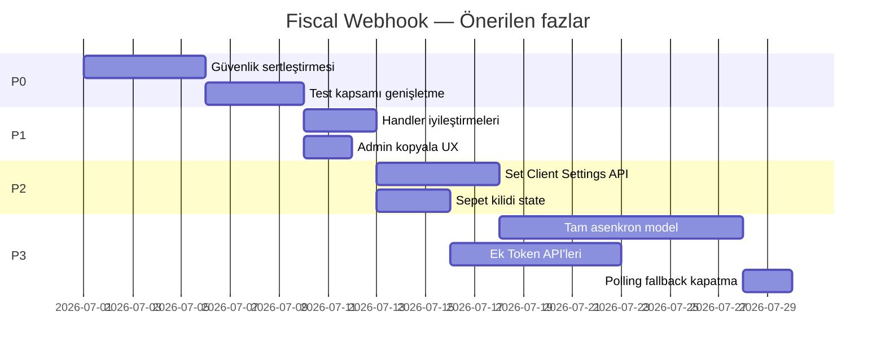

# Token X-Connect Cloud Webhook — Kalan İşler Yol Haritası

> **Oluşturulma:** 2026-06-26  
> **Bağlam:** Beko ÖKC bulut entegrasyonu webhook MVP'si tamamlandı (hibrit model). Bu belge MVP **sonrası** yapılacakları, öncelik sırasıyla ve uygulanabilir iş paketleri halinde tanımlar.  
> **İlgili:** `docs/wiki/Fiscal_Integration.md`, `docs/wiki/Fiscal_Integration_Production.md`, `.omnirule/research/okc-entegrasyon-analizi-2026-06-25.md`

---

## 1. MVP'de tamamlananlar (referans)

Aşağıdakiler **yapıldı**; bu planda tekrar implement edilmez, sadece genişletilir:

| Bileşen | Konum |
|---------|--------|
| Webhook endpoint | `backend/apps/sales/views_fiscal_webhook.py` → `POST /api/v1/sales/fiscal/webhook/<terminal_uuid>/` |
| Webhook işleme | `backend/apps/sales/fiscal/webhook_service.py` |
| Bekleyen sepet modeli | `backend/apps/sales/models.py` → `FiscalPendingBasket` |
| Hibrit bekleme (120 sn DB poll) | `wait_for_basket_completion()` |
| Polling fallback | `backend/apps/sales/fiscal/beko_driver.py` → `_poll_token_basket_status()` |
| Env / kurulum | `FISCAL_WEBHOOK_BASE_URL` — `settings.py`, `install.sh`, `update.sh`, `ramis_settings` |
| Admin webhook URL | `PosTerminalSerializer.fiscal_webhook_url`, `FiscalSettingsForm.tsx` |
| Temel testler | `backend/apps/sales/tests/test_fiscal.py` → `TestFiscalWebhook` |
| Prod rehberi | `docs/wiki/Fiscal_Integration_Production.md` |

**Mevcut ödeme modeli:** Senkron hibrit (A) — `create_sale_for_order` içinde mali işlem bitene kadar HTTP isteği açık kalır; fiscal başarısızsa transaction rollback devam eder.

---

## 2. Öncelik matrisi

| Öncelik | İş paketi | Gerekçe |
|---------|-----------|---------|
| **P0** | Güvenlik sertleştirmesi | Prod'da public endpoint |
| **P0** | Test kapsamı genişletme | Regresyon riski yüksek |
| **P1** | Webhook handler iyileştirmeleri | Idempotency, cancel/99, HTTP semantiği |
| **P1** | Admin UX (kopyala, hata mesajları) | Operasyonel sürtünme |
| **P2** | Set Client Settings otomasyonu | Manuel adımı kaldırır |
| **P2** | BASKET_LOCKED/UNLOCKED durum yönetimi | Sepet kilidi senaryoları |
| **P3** | Tam asenkron ödeme modeli (B) | UX + mimari karar gerektirir |
| **P3** | Ek Token API'leri (Update/Delete/Unlock/Get Terminal) | Ayrı feature set |
| **P3** | Polling fallback kaldırma | Webhook güvenilirliği kanıtlandıktan sonra |

---

## 3. İş paketleri (detay)

---

### P0-1 — Webhook güvenlik sertleştirmesi

**Hedef:** Public endpoint'in yetkisiz veya sahte çağrılara karşı korunması.

**Mevcut durum:**
- JWT/CSRF kapalı (`AllowAny`, `csrf_exempt`) — doğru.
- `_verify_webhook_identity()` yalnızca `terminalId` ve `clientId` string eşleştirmesi yapıyor; uyuşmazlıkta sessizce ignore.
- İmza doğrulama, rate limit, IP kısıtı yok.
- `throttle_classes = []`.

**Yapılacaklar:**

1. **Token resmi dokümantasyonunu oku** — webhook imza/HMAC/secret mekanizması var mı, header adları, payload canonicalization.
2. **`webhook_service._verify_webhook_signature()`** (veya eşdeğeri) ekle:
   - Doğrulama başarısız → `401` veya `403` (Token retry politikasına göre seç; dokümana uy).
   - Secret: terminal `fiscal_settings` veya ortam düzeyi paylaşımlı secret (Token'ın modeline göre).
3. **Rate limiting:**
   - DRF throttle sınıfı veya nginx `limit_req` — terminal bazlı veya IP bazlı.
   - Token'ın callback IP aralığı dokümante edilmişse nginx allowlist değerlendir.
4. **Log maskeleme:**
   - `client_secret`, `accessToken`, Authorization header loglara yazılmasın.
   - `beko_driver.py` exception mesajlarında credential sızıntısı kontrol et.
5. **Webhook URL tahmin edilebilirliği:**
   - Opsiyonel: path'e `terminal_uuid` yerine veya ek olarak uzun rastgele `webhook_secret` segmenti (breaking change — Token URL kaydı güncellenmeli).

**Dosyalar:**
- `backend/apps/sales/views_fiscal_webhook.py`
- `backend/apps/sales/fiscal/webhook_service.py`
- `backend/config/settings.py` (gerekirse `FISCAL_WEBHOOK_SECRET` vb.)
- `docs/wiki/Fiscal_Integration.md` (güvenlik bölümü)

**Kabul kriterleri:**
- [ ] Sahte imzalı POST reddedilir.
- [ ] Geçerli Token payload'ı işlenir.
- [ ] Log çıktısında secret/token görünmez.
- [ ] Rate limit aşımında 429 döner.

**Bağımlılık:** Token developer portal dokümantasyonu.

---

### P0-2 — Test kapsamı genişletme

**Hedef:** Webhook ve hibrit akışın regresyonunu güvence altına almak.

**Mevcut testler** (`TestFiscalWebhook`):
- `test_build_fiscal_webhook_url`
- `test_webhook_completes_pending_basket` (status 0)
- `test_webhook_endpoint_accepts_basket_completed`
- `test_driver_returns_after_webhook` (mock wait)

**Eksik testler — eklenecek:**

| Test | Senaryo |
|------|---------|
| `test_webhook_payment_cancelled` | `BASKET_COMPLETED`, `status: -1` → `FiscalBasketStatus.CANCELLED` |
| `test_webhook_receipt_void` | `BASKET_COMPLETED`, `status: 99` → `FAILED` veya ayrı status |
| `test_webhook_idempotent_duplicate` | Aynı basket_id için ikinci webhook → status değişmez, çift side-effect yok |
| `test_webhook_unknown_basket` | Kayıtsız basket_id → 200 + log (Token retry davranışına göre assert) |
| `test_webhook_terminal_mismatch` | Yanlış `terminalId` → ignore / 403 |
| `test_webhook_invalid_payload` | Eksik `operation`, `data`, `basketID` → uygun HTTP |
| `test_wait_for_basket_cancelled_raises` | `wait_for_basket_completion` → `OrderValidationError` |
| `test_sale_rollback_on_fiscal_cancel` | `create_sale_for_order` + webhook cancel simülasyonu → Sale oluşmaz |
| `test_e2e_basket_to_sale_fiscal_printed` | Mock Token POST instant + webhook POST → `sale.fiscal_printed=True` |

**Dosyalar:**
- `backend/apps/sales/tests/test_fiscal.py`
- Gerekirse `backend/apps/sales/tests/conftest.py` (webhook helper fixture)

**Kabul kriterleri:**
- [ ] Yukarıdaki senaryoların tamamı yeşil.
- [ ] CI'da mevcut 19+ fiscal test regresyonu korumalı.

---

### P1-1 — Webhook handler iyileştirmeleri

**Hedef:** Token retry davranışı, idempotency ve operasyon tipleri için net semantik.

**Mevcut davranış sorunları:**

1. **Bilinmeyen sepet** → `handle_token_webhook` `True` döner, view `200 ok` — Token tekrar denemeyebilir; dokümana göre netleştir.
2. **BASKET_LOCKED / BASKET_UNLOCKED** → sadece log; `FiscalPendingBasket` veya ayrı lock state yok.
3. **Idempotency** → kod var (`pending.status != PENDING` → skip) ama test ve dokümantasyon yok.
4. **Path farkı:** Plan `/api/v1/fiscal/webhook/` önermişti; gerçek path `/api/v1/sales/fiscal/webhook/`. Token kayıtları buna göre yapılmalı; alias route gerekir mi değerlendir.

**Yapılacaklar:**

1. Token dokümantasyonuna göre HTTP yanıt matrisi tablosu oluştur ve uygula:

   | Durum | Önerilen HTTP |
   |-------|----------------|
   | Başarılı işlendi | 200 |
   | Geçersiz payload | 400 |
   | Terminal bulunamadı | 404 |
   | İmza/geçersiz kimlik | 401/403 |
   | İşleme hatası (retry uygun) | 500 |
   | Bilinmeyen sepet (retry istenmiyor) | 200 ignore |

2. **`BASKET_LOCKED`:** Opsiyonel `locked_at`, `locked_by` alanları `FiscalPendingBasket`'e veya JSON `result_payload` meta.
3. **`BASKET_UNLOCKED`:** Lock state temizleme; driver tarafında bekleme devam edebilsin.
4. Tamamlanan sepet için **audit:** `completed_at` zaten var; webhook ham payload `result_payload`'da.

**Dosyalar:**
- `backend/apps/sales/fiscal/webhook_service.py`
- `backend/apps/sales/models.py` (opsiyonel migration)
- `backend/apps/sales/views_fiscal_webhook.py`

**Kabul kriterleri:**
- [ ] HTTP yanıt matrisi dokümante ve test edilmiş.
- [ ] Çift webhook idempotent.
- [ ] LOCKED/UNLOCKED en azından log + opsiyonel state.

---

### P1-2 — Admin panel UX iyileştirmeleri

**Hedef:** Operatörün webhook URL'sini hatasız Token'a kaydetmesi.

**Mevcut durum:**
- `FiscalSettingsForm.tsx`: salt okunur `Input` ile URL gösteriliyor.
- Ayrı "Kopyala" butonu yok.
- Webhook URL yoksa açıklayıcı metin var.

**Yapılacaklar:**

1. **Kopyala butonu** — clipboard API + toast ("URL kopyalandı").
2. **Durum göstergesi:**
   - `FISCAL_WEBHOOK_BASE_URL` boş → sunucu tarafında env eksik uyarısı (backend health veya serializer flag).
   - Terminal henüz kaydedilmemiş → "Önce terminali kaydedin" mesajı (zaten kısmen var).
3. **İsteğe bağlı (P2 ile birlikte):** "Token'a kaydet" butonu — Set Client Settings API bağlandığında.

**Dosyalar:**
- `frontend/src/features/admin/components/tabs/pos-settings/FiscalSettingsForm.tsx`
- `frontend/messages/tr.json`, `en.json` (i18n)
- `backend/apps/pos_display/serializers.py` (opsiyonel `fiscal_webhook_configured` flag)

**Kabul kriterleri:**
- [ ] Tek tıkla URL panoya kopyalanır.
- [ ] Env eksikliği kullanıcıya net gösterilir.

---

### P2-1 — Token Set Client Settings otomasyonu

**Hedef:** Terminal kaydedilirken veya güncellenirken webhook URL'sinin Token API ile otomatik kaydı.

**Mevcut durum:** Manuel — operatör Token portalından URL girer. `build_fiscal_webhook_url()` URL üretir.

**Yapılacaklar:**

1. **Token Set Client Settings API** endpoint ve payload formatını dokümante et.
2. **`backend/apps/sales/fiscal/token_client_settings.py`** (yeni servis):
   - `register_webhook_for_terminal(terminal) -> bool`
   - Terminal `client_id`, `client_secret`, `api_url` kullanarak Token'a POST.
   - Webhook URL: `build_fiscal_webhook_url(terminal.pk)`.
3. **Tetikleme noktaları:**
   - `PosTerminal` create/update (CLOUD + BEKO_GMP3) sonrası signal veya serializer `create`/`update`.
   - Admin "Token'a kaydet" butonu (manuel retry).
4. **Hata yönetimi:** Token API hatası terminal kaydını engellemesin (soft fail + admin uyarısı).
5. **Idempotency:** Aynı URL tekrar kayıt güvenli olmalı.

**Dosyalar:**
- Yeni: `backend/apps/sales/fiscal/token_client_settings.py`
- `backend/apps/pos_display/views.py` veya `serializers.py`
- `frontend/.../FiscalSettingsForm.tsx`
- Test: mock Token API

**Kabul kriterleri:**
- [ ] Terminal kaydında Token webhook URL otomatik set edilir (veya butonla).
- [ ] Hata durumunda terminal yine kaydedilir, operatöre mesaj gösterilir.

**Bağımlılık:** Token prod API erişimi, Set Client Settings dokümantasyonu.

---

### P2-2 — BASKET_LOCKED / UNLOCKED — sepet kilidi yönetimi

**Hedef:** Kasiyer yazar kasada sepeti kilitlediğinde Ramis'in bunu bilmesi; timeout ve iptal senaryolarında doğru UX.

**Mevcut durum:** Webhook kabul edilir, loglanır, state güncellenmez.

**Yapılacaklar:**

1. `FiscalPendingBasket` modeline opsiyonel alanlar:
   - `lock_state`: `NONE | LOCKED | UNLOCKED`
   - `locked_by`, `locked_at`
2. `handle_token_webhook` LOCKED/UNLOCKED'da bu alanları güncelle.
3. `wait_for_basket_completion`: LOCKED durumunda bekleme devam; UNLOCKED sonrası COMPLETED bekle.
4. **İleride:** Token **Unlock Basket API** ile programatik kilit açma (P3-2).

**Dosyalar:**
- `backend/apps/sales/models.py` + migration
- `backend/apps/sales/fiscal/webhook_service.py`

**Kabul kriterleri:**
- [ ] LOCKED webhook DB'de görünür.
- [ ] Driver bekleme davranışı lock durumuna göre dokümante.

---

### P3-1 — Tam asenkron ödeme modeli (Model B)

**Hedef:** Uzun HTTP transaction'ı kaldırmak; Token'ın önerdiği webhook-first akış.

**Mevcut durum (Model A — Hibrit):**
```
POS HTTP → create_sale_for_order → send basket → wait 120s (DB poll) → fiscal alanları yaz → response
```
Risk: Uvicorn/worker timeout, DB connection uzun süre açık, eşzamanlı kasa yükü.

**Hedef akış (Model B):**
```
POS HTTP → sepet gönder → Sale PENDING_FISCAL (veya ayrı state) → hızlı response
Token webhook → Sale fiscal alanları güncelle → WebSocket pos_sync
POS overlay → fiscal_completed | fiscal_cancelled event dinle
```

**Karar noktaları (ürün + mimari):**

| Soru | Seçenekler |
|------|------------|
| Sale ne zaman oluşur? | A) Sepet gönderilince PENDING sale; webhook'ta CONFIRMED. B) Webhook success'te sale oluşur (rollback farklı). |
| Rollback kuralı | Fiscal fail → sale sil / iptal mi, yoksa `fiscal_failed` state mi? |
| Timeout | Webhook gelmezse: otomatik iptal, kasiyere uyarı, Delete Basket API? |
| Ödeme kaydı | `Payment` satırı fiscal onaydan önce mi sonra mı? |

**Önerilen implementasyon adımları:**

1. **Model:** `Sale.fiscal_status` enum: `NOT_APPLICABLE | PENDING | COMPLETED | CANCELLED | FAILED | TIMEOUT`
2. **`create_sale_for_order` refactor:** Fiscal CLOUD ise erken dönüş veya async branch.
3. **Webhook handler:** `Sale` mali alanlarını doğrudan güncelle (driver beklemeden).
4. **WebSocket:** `backend/apps/orders/ws_broadcast.py` — yeni event tipleri:
   - `fiscal_completed` { sale_id, order_id, receipt_no, ... }
   - `fiscal_cancelled` { sale_id, order_id, reason }
5. **Frontend POS:** `posSyncChannel.ts` / `TableOrderModal` — overlay webhook event'e bağla.
6. **Timeout job:** Celery beat — `FiscalPendingBasket` PENDING > N dk → TIMEOUT + operatör bildirimi.

**Dosyalar:**
- `backend/apps/orders/services/sale_helper.py`
- `backend/apps/sales/fiscal/beko_driver.py`
- `backend/apps/sales/fiscal/webhook_service.py`
- `backend/apps/orders/ws_broadcast.py`
- `frontend/src/store/posSyncChannel.ts`
- `frontend/src/features/tables/.../TableOrderModal/`

**Kabul kriterleri:**
- [ ] POS HTTP yanıt süresi < 5 sn (sepet gönderimi sonrası).
- [ ] Webhook ile sale tamamlanır ve POS anlık bilgilendirilir.
- [ ] Fiscal fail senaryosunda veri tutarlılığı korunur (rollback veya explicit failed state).

**Not:** Bu paket büyük refactor; Model A prod'da stabil olduktan ve webhook güvenilirliği kanıtlandıktan sonra planlanmalı.

---

### P3-2 — Ek Token X-Connect API'leri

**Hedef:** Sepet yaşam döngüsü ve terminal keşfi.

**API'ler (Token dokümantasyonu):**

| API | Kullanım |
|-----|----------|
| Update Basket | Sepet kalemi değişikliği (sipariş güncelleme) |
| Delete Basket | İptal / timeout temizliği |
| Unlock Basket | Kilitli sepet programatik açma |
| Get Terminal | Şube cihaz listesi, seri no doğrulama |

**Yapılacaklar:**

1. `backend/apps/sales/fiscal/beko_client.py` — ortak HTTP katmanı (auth, retry, headers).
2. Her API için metod + `OrderValidationError` eşlemesi.
3. Admin: Get Terminal ile terminal listesi dropdown (opsiyonel).
4. Timeout/cancel akışında Delete Basket çağrısı.

**Dosyalar:**
- Yeni: `backend/apps/sales/fiscal/beko_client.py`
- `backend/apps/sales/fiscal/beko_driver.py` (ince refactor)
- Admin UI (opsiyonel)

**Kabul kriterleri:**
- [ ] Delete Basket timeout senaryosunda çağrılabilir.
- [ ] Unit testler mock HTTP ile.

---

### P3-3 — Polling fallback kaldırma veya devre dışı bırakma

**Hedef:** Webhook birincil kanal olduktan sonra Token API polling maliyetini ve rate limit riskini azaltmak.

**Mevcut durum:** `wait_for_basket_completion` timeout → `_poll_token_basket_status()` (10 deneme, exponential backoff).

**Yapılacaklar:**

1. **Metrik toplama:** Webhook vs fallback oranı (log veya Prometheus).
2. **Feature flag:** `FISCAL_POLLING_FALLBACK_ENABLED` (default `True` → prod stabil olunca `False`).
3. Fallback kapalıyken timeout → net `OrderValidationError` + operatör mesajı.
4. Wiki ve prod rehberi güncelle.

**Dosyalar:**
- `backend/apps/sales/fiscal/beko_driver.py`
- `backend/config/settings.py`
- `docs/wiki/Fiscal_Integration.md`

**Kabul kriterleri:**
- [ ] Prod'da fallback oranı <%5 veya kabul edilen eşik.
- [ ] Flag ile fallback kapatılabilir.

**Bağımlılık:** P0-1, P0-2, prod webhook kaydı doğrulandı.

---

### P3-4 — Altyapı ve operasyon (kod dışı checklist)

Bu maddeler kod değil; canlı ortamda doğrulanmalı. Detay: `docs/wiki/Fiscal_Integration_Production.md`.

- [ ] `FISCAL_WEBHOOK_BASE_URL` = public HTTPS kök (path yok)
- [ ] nginx `/api/v1/sales/fiscal/webhook/` → Uvicorn
- [ ] Token Set Client Settings ile her terminal webhook URL kayıtlı
- [ ] Test API URL prod'da kullanılmıyor (`fiscal_settings.api_url`)
- [ ] Staging: ngrok veya staging domain + Token test API eşleştirmesi
- [ ] Uvicorn/worker timeout ≥ 120 sn (hibrit model A süresince) veya Model B'ye geç

---

## 4. Önerilen uygulama sırası



**Pratik sıra (tek geliştirici):**

1. P0-2 testler (mevcut davranışı kilitle)
2. P0-1 güvenlik
3. P1-1 handler HTTP semantiği
4. P1-2 admin kopyala
5. Canlı pilot (P3-4 checklist)
6. P2-1 Set Client Settings
7. Ürün kararı: Model B gerekli mi?
8. P3-1 veya P3-3

---

## 5. Riskler ve bağımlılıklar

| Risk | Etki | Azaltma |
|------|------|---------|
| Token webhook imza formatı belirsiz | P0-1 gecikir | Token ekibiyle doğrulama |
| Hibrit model timeout (120 sn) | POS donması, worker tıkanması | nginx timeout artır veya Model B |
| Webhook kaydı unutulması | Sürekli polling fallback | P2-1 otomasyon + prod checklist |
| Çift webhook / out-of-order | Yanlış sale state | Idempotency + status machine |
| Test vs prod URL karışması | Prod'da test cihaz hatası | `Fiscal_Integration_Production.md` + form validasyonu |

---

## 6. İlgili dosya haritası

```
backend/
  apps/sales/
    fiscal/
      beko_driver.py          # Sepet gönder, wait, polling fallback
      beko_result.py          # BASKET_COMPLETED payload parse
      webhook_service.py      # register, wait, handle_token_webhook
      token_client_settings.py  # [P2-1] YENİ
      beko_client.py            # [P3-2] YENİ
    models.py                 # FiscalPendingBasket
    views_fiscal_webhook.py   # Public endpoint
    tests/test_fiscal.py
  apps/orders/
    services/sale_helper.py   # create_sale_for_order, rollback
    ws_broadcast.py           # [P3-1] fiscal event
  apps/pos_display/
    serializers.py            # fiscal_webhook_url
frontend/
  features/admin/.../FiscalSettingsForm.tsx
  features/tables/.../TableOrderModal/  # [P3-1] overlay
  store/posSyncChannel.ts     # [P3-1] event dinleme
docs/wiki/
  Fiscal_Integration.md
  Fiscal_Integration_Production.md
```

---

## 7. Wiki senkronizasyonu

Bu plandaki iş paketi tamamlandığında ilgili wiki güncellenmeli:

| Tamamlanan paket | Wiki güncellemesi |
|------------------|-------------------|
| P0-1 | `Fiscal_Integration.md` — Güvenlik bölümü |
| P2-1 | `Fiscal_Integration.md` — Set Client Settings otomasyonu (gelecek plan → mevcut) |
| P3-1 | `Fiscal_Integration.md` — sequence diagram, Model B |
| P3-3 | Polling fallback notu kaldır / flag dokümante |
| P3-4 | `Fiscal_Integration_Production.md` — checklist işaretleme |

---

## 8. Açık kararlar (ürün sahibi)

Aşağıdakiler implementasyona başlamadan netleştirilmeli:

1. **Model A yeterli mi, Model B ne zaman?** — Mevcut hibrit prod'da kabul edilebilir mi?
2. **Polling fallback ne zaman kapatılır?** — Metrik eşiği?
3. **Webhook path alias** — `/api/v1/fiscal/webhook/` eski doküman uyumu için gerekli mi?
4. **Sale oluşum zamanı (Model B)** — PENDING sale mi, webhook'ta finalize mi?
5. **Set Client Settings** — Otomatik mi, buton mu, ikisi de mi?
