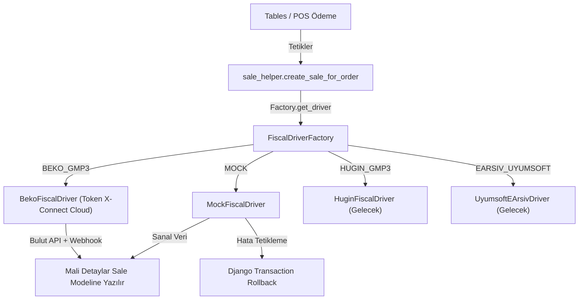

# 🧾 Mali Entegrasyon Altyapısı (Fiscal Integration)

> **Özet:** Ramis ERP'nin Türkiye yasal mevzuatına (YN ÖKC ve e-Arşiv tebliğleri) uyum sağlaması için geliştirilmiş modüler, sürücü tabanlı (driver-based) mali entegrasyon katmanıdır. POS terminallerinden yapılan satışların mali fiş veya e-Arşiv faturalarının düzenlenmesini, hata durumlarında ise veritabanı işlemlerinin otomatik olarak geri alınmasını (rollback) sağlar.

- **Kütüphaneler:** Django, PostgreSQL (JSONField), React, TailwindCSS, Lucide Icons, Shadcn/ui
- **Bağlantılar:** [[Sales]], [[POS_Display]], [[Frontend_POS]], [[Invoices]], [[Index]]

---

## 🏗️ Mimari Tasarım ve Sürücü Yapısı

Mali entegrasyon sistemi, genişletilebilirliği ve donanım bağımsızlığını garanti altına almak için **Factory (Fabrika)** ve **Strategy (Strateji)** tasarım kalıplarıyla kurulmuştur.



### 1. Sürücü Taban Sınıfı (`BaseFiscalDriver`)
*   `backend/apps/sales/fiscal/base.py`
*   Tüm mali entegrasyon sürücüleri bu sınıftan türemek zorundadır. Ortak `send_invoice_or_receipt(sale)` ve `get_status()` soyut metotlarını tanımlar.
*   `get_fiscal_parameters()` opsiyonel metodu: Alt sınıfların cihazın mali parametrelerini (kısım/section listesi, KDV oranları) almasını sağlar.

### 2. Sanal Sürücü (`MockFiscalDriver`)
*   `backend/apps/sales/fiscal/mock_driver.py`
*   Fiziksel donanım veya lisans olmadan uçtan uca akışı test etmek için geliştirilmiş simülatördür. Rastgele ama gerçekçi ÖKC seri numarası, fiş numarası, Z numarası ve GİB karekod verileri üretir. `trigger_error` ve `simulate_offline` parametreleriyle hata durumlarını simüle edebilir.

### 3. Beko Bulut Sürücüsü (`BekoFiscalDriver`)
*   `backend/apps/sales/fiscal/beko_driver.py`
*   **Token Inc. "Token X-Connect Cloud"** API'si ile entegredir.
*   Resmi API Dokümanı: https://developer.tokeninc.com/token-developer-portal-1/x-platform/token-x-connect-cloud/gelistirici-dokumani-tr

#### Entegrasyon Akışı

```mermaid
sequenceDiagram
    participant POS as Ramis POS
    participant Backend as Django Backend
    participant Cloud as Token X-Connect Cloud
    participant OKC as Beko ÖKC Cihazı
    participant Webhook as Webhook Endpoint

    POS->>Backend: Ödeme Talebi (pos_terminal_id)
    Backend->>Cloud: POST /v1/auth/token (Basic Auth)
    Cloud-->>Backend: accessToken (24 saat geçerli, cache'lenir)
    Backend->>Cloud: GET /v1/fiscal-parameters (terminal-id)
    Cloud-->>Backend: sections[] (sectionNo, taxPercent eşleştirme)
    Backend->>Cloud: POST /v1/basket/instant (UUID v4 basketID)
    Cloud-->>Backend: status: 0 (Sepet gönderildi)
    Cloud->>OKC: Sepet ekranda gösterilir
    OKC-->>Cloud: Kasiyer ödemeyi onaylar
    Cloud->>Webhook: POST BASKET_COMPLETED (receiptNo, zNo, UUID)
    Backend->>Backend: FiscalPendingBasket güncelle (webhook_service)
    Note over Backend: Webhook bekleme (120s); zaman aşımında Token API polling fallback
    Backend-->>POS: Mali fiş bilgileri kaydedildi
```

#### Önemli Teknik Detaylar

| Özellik | Detay |
|---------|-------|
| **API URL (Test)** | `https://test-api.devtokeninc.com/app-store/external` |
| **API URL (Prod)** | Token ekibi tarafından iletilecek |
| **Auth** | OAuth2 Basic Auth → Bearer Token (24 saat) |
| **Token Caching** | Django cache (Redis), 23 saat TTL |
| **basketID** | Her sepet için yeni UUID v4 üretilir |
| **sectionNo** | Fiscal Parameters API'den alınır, KDV oranıyla eşleştirilir |
| **taxPercent** | Binde cinsinden: %10 → `1000`, %20 → `2000` |
| **price** | Kuruş cinsinden: ₺100.00 → `10000` |
| **quantity** | Mili-adet: 1 adet → `1000` |
| **Retry** | 429 Rate Limit → Exponential backoff (2s → 4s → 8s, max 3 deneme) |
| **Webhook (birincil)** | `POST /api/v1/sales/fiscal/webhook/{terminal_id}/` — `BASKET_COMPLETED` |
| **Webhook kimlik** | `connection_type=CLOUD` değilse 404 (yerel/offline ÖKC etkilenmez). Ayarlı `serial_number` / `client_id` yoksa veya uyuşmazsa 403 (`FiscalWebhookAuthError`). Opsiyonel `fiscal_settings.webhook_secret` → `X-Ramis-Webhook-Secret`. JWT yok; AnonRateThrottle 30/dk. |
| **Webhook bekleme** | `FiscalPendingBasket` DB kaydı; 120 sn; zaman aşımında Token API polling fallback |
| **Env** | `FISCAL_WEBHOOK_BASE_URL` — Token Set Client Settings için public API kökü (path yok) |

#### Webhook Bildirimleri (Token X-Connect Cloud)

Token, asenkron işlem sonuçlarını **webhook** ile bildirir. Webhook URL'si `Set Client Settings API` ile tanımlanır. Desteklenen webhook operasyonları:

**`BASKET_COMPLETED` — Ödeme Tamamlandı (status: 0)**
```json
{
    "terminalId": "AV00000000001",
    "clientId": "ece000ef-...",
    "operation": "BASKET_COMPLETED",
    "operationDate": "2025-03-10T08:42:18.640Z",
    "data": {
        "basketID": "f85d8ce7-...",
        "documentType": 0,
        "InstanceIdentifier": "XXXX",
        "invoiceID": "",
        "message": "OK",
        "paymentCount": 1,
        "paymentItems": [
            { "amount": 4000, "type": 1, "description": "Payment with cash" }
        ],
        "receiptNo": 2,
        "status": 0,
        "UUID": "afae6f21-...",
        "zNo": 87
    }
}
```

**`BASKET_COMPLETED` — Ödeme İptal (status: -1)**
```json
{
    "operation": "BASKET_COMPLETED",
    "data": {
        "basketID": "f530e8cf-...",
        "documentType": 9006,
        "message": "CANCELLED",
        "status": -1
    }
}
```

**`BASKET_COMPLETED` — Fiş İptali (status: 99)**
```json
{
    "operation": "BASKET_COMPLETED",
    "data": {
        "basketID": "b4769601-...",
        "message": "CANCELLED",
        "receiptNo": -1,
        "status": 99,
        "zNo": -1
    }
}
```

**`BASKET_LOCKED` / `BASKET_UNLOCKED` — Sepet Kilit Durumu**
```json
{
    "operation": "BASKET_LOCKED",
    "data": { "basketID": "c6ffdfeb-...", "lockedBy": "AV0000000001" }
}
```

#### Token X-Connect Cloud API Statü Kodları

| Kod | Açıklama | Tür |
|-----|----------|-----|
| 0 | Başarılı | success |
| 0001 | JWT token algoritma hatası | auth |
| 0002 | JWT token süresi dolmuş | auth |
| 0003 | JWT token imza doğrulama hatası | auth |
| 0004 | Authorization header eksik/hatalı | auth |
| 0006 | terminal-id/branch-id/merchant-id eksik | header |
| 0007 | Birden fazla credential header | header |
| 1006 | Kayıt bulunamadı | error |
| 1007 | Duplike kayıt | error |
| 1013 | Yanlış veri formatı | error |
| 1018 | Sepet kilitli, unlock gerekli | error |
| 1100 | Terminalde zaten açık sepet var | error |
| 1101 | Bu çek numarasıyla zaten açık sepet var | error |
| 1102 | Sepet zaten tamamlanmış | error |
| 1103 | Ürün toplamı ile ödeme toplamı eşleşmiyor | error |
| 1104 | Terminal modu instant basket almaya uygun değil | error |
| 1105 | Sepet statusü bu operasyona uygun değil | error |
| 1106 | Bu ID ile cihaz bulunamadı | error |

### 4. Sürücü Fabrikası (`FiscalDriverFactory`)
*   `backend/apps/sales/fiscal/factory.py`
*   POS terminalinin yapılandırılmış `fiscal_type` alanına göre ilgili yazar kasa/fatura sürücüsünü dinamik olarak başlatır ve döner.

---

## 💾 Veritabanı ve Model Karşılıkları

### 1. `PosTerminal` Model Değişiklikleri (`pos_display/models.py`)
*   `fiscal_type`: Terminalin mali entegrasyon türünü belirler (`NONE`, `MOCK`, `BEKO_GMP3`, `HUGIN_GMP3`, `EARSIV_UYUMSOFT`).
*   `fiscal_settings`: `JSONField` — parametreleri JSON olarak saklar:

**CLOUD bağlantı türü için `fiscal_settings` şeması:**
```json
{
    "connection_type": "CLOUD",
    "serial_number": "AV0000000658",
    "client_id": "...",
    "client_secret": "...",
    "api_url": "https://test-api.devtokeninc.com/app-store/external",
    "auth_url": ""
}
```

### 3. `FiscalPendingBasket` (`sales/models.py`)
Token X-Connect instant sepet → webhook eşlemesi:
*   `basket_id`: UUID v4 (Token'a gönderilen sepet kimliği)
*   `sale`, `pos_terminal`: İlişkili satış ve terminal
*   `status`: `PENDING` | `COMPLETED` | `CANCELLED` | `FAILED`
*   `result_payload`: Webhook `BASKET_COMPLETED` ham `data` alanı

### 4. Webhook endpoint (MVP)
*   **URL:** `POST /api/v1/sales/fiscal/webhook/<terminal_uuid>/`
*   **Kimlik doğrulama:** JWT yok; `terminalId` + `clientId` payload doğrulaması
*   **Kod:** `sales/views_fiscal_webhook.py`, `sales/fiscal/webhook_service.py`
*   **Admin URL türetimi:** `{FISCAL_WEBHOOK_BASE_URL}/api/v1/sales/fiscal/webhook/{terminal_id}/` → `PosTerminalSerializer.fiscal_webhook_url`

### 5. `Sale` Model Değişiklikleri (`sales/models.py`)
Satışın mali denetim doğruluğu için aşağıdaki alanlar eklenmiştir:
*   `fiscal_printed`: Mali fişin basılıp basılmadığını belirtir.
*   `okc_serial_number`: ÖKC Seri No.
*   `okc_receipt_number`: ÖKC Fiş No.
*   `okc_z_number`: Z Raporu No.
*   `okc_receipt_datetime`: Fişin mali basım zamanı.
*   `fiscal_qr_code`: GİB yasal doğrulama karekodu.
*   `fiscal_raw_response`: Cihazdan gelen tüm ham API yanıtı.

---

## 🔄 Ödeme Akışı ve Veri Bütünlüğü (Rollback)

1.  Kasiyer ödemeyi başlattığında, Next.js POS arayüzü `pos_terminal_id` bilgisini de içeren bir istek gönderir.
2.  `create_sale_for_order` servisi satış ve ödeme kayıtlarını veritabanına yazar.
3.  Eğer terminalde bir mali entegrasyon aktifse, yazar kasa tetiklenir:
    *   **Başarılı:** Mali fiş bilgileri `Sale` nesnesine yazılarak kaydedilir.
    *   **Hatalı:** Cihazdan hata dönerse veya bağlantı koparsa bir `OrderValidationError` fırlatılır.
4.  Fırlatılan hata sayesinde Django veritabanı işlemi **rollback (geri alma)** edilir. Veritabanında hiçbir satış veya ödeme kaydı kalmaz, böylece fiş kesilemediğinde satışın sisteme kaydedilmesi engellenmiş olur.

---

## 🎨 Arayüz ve Kullanıcı Deneyimi

### 1. Yönetici POS Ayarları
*   Yöneticiler `Yönetici Paneli -> POS Ayarları` ekranından JSON kodu yazmadan, form girdileri (IP, port, seri numarası vb.) üzerinden terminal yazar kasa ayarlarını kolayca yapabilirler.
*   Bileşenler: `PosTerminalsPanel.tsx` ve `FiscalSettingsForm.tsx`.
*   CLOUD bağlantı seçildiğinde **Client ID**, **Client Secret**, **API URL**, **Auth URL** ve **Terminal ID** alanları gösterilir.
*   İki sütunlu modal: temel alanlar solda, entegrasyon parametreleri sağda.
*   Webhook endpoint URL'si ( `fiscal_webhook_url` ) kopyalanabilir alan olarak gösterilir; `FISCAL_WEBHOOK_BASE_URL` tanımlı olmalıdır.
*   Token **Set Client Settings** API ile webhook URL kaydı operatör tarafından yapılır.
*   **Üretim ortamı adım adım rehber:** [[Fiscal_Integration_Production]]

### 2. Kasiyer Ödeme Ekranı Overlay
*   Ödeme işlemi sürerken ve mali yazar kasayla haberleşilirken kasiyerin hatalı başka bir işlem yapmasını engellemek için ekranı donduran **Mali İşlem Yapılıyor** yükleme katmanı (blur overlay) gösterilir.
*   Bileşen: `TableOrderModal/index.tsx`.

---

## 🔜 Gelecek Planlar

*   **Token Set Client Settings otomasyonu:** Terminal kaydında webhook URL'sini Token API ile otomatik kaydetme.
*   **WebSocket ile POS bildirimi:** Ödeme sonucunun `pos_sync` kanalı üzerinden anlık iletimi (tam asenkron UX).
*   **Webhook imza doğrulama:** Token dokümantasyonuna göre HMAC/secret doğrulama.
*   **Sepet Güncelleme / Silme / Kilit Açma:** Update Basket, Delete Basket, Unlock Basket API'leri backend servislerine eklenecek.
*   **Terminal Listesi API:** Get Terminal API ile şube terminallerinin otomatik keşfi.
