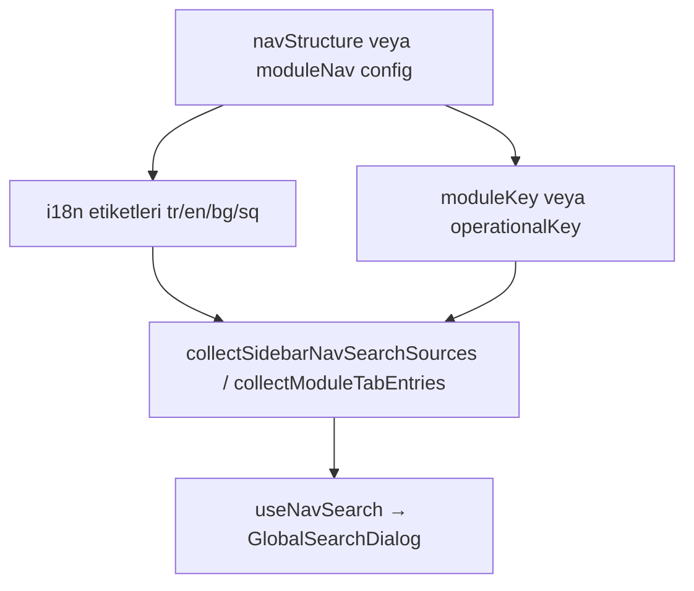

# Frontend Search — Global Arama (⌘K)

- **Özet:** Uygulamanın her sayfasında erişilebilen command palette tarzı global arama sistemi. Ctrl+K / ⌘K ile açılır; sidebar menüsü ve modül sekmelerinde client-side navigasyon araması yapar, ayrıca backend API üzerinden kayıt (ürün, sipariş, stok vb.) arar. RBAC izinlerine göre sonuçlar filtrelenir; grup etiketleri `next-intl` ile yerelleştirilir.
- **Kütüphaneler:** React, TanStack Query, Radix UI Dialog, next-intl
- **Bağlantılar:** [[Frontend_Architecture]], [[Frontend_POS]], [[Search]], [[RBAC]], [[Internationalization]]

---

## Bileşenler

### `GlobalSearchDialog`

Ana command palette bileşeni. [[AppHeader]] içinden tetiklenir.

| Özellik | Açıklama |
|---------|----------|
| **Kısayol** | `Ctrl+K` / `⌘K` (Mac) |
| **Minimum karakter** | 2 karakter sonra arama başlar |
| **Debounce (API)** | 300ms |
| **Menü araması** | Anında (client-side), sonuçlar üstte "Sayfalar" grubunda |
| **UUID arama** | UUID formatı tespit edilir ve doğrudan sorgulanır |
| **Klavye** | ↑↓ ile gezinme, Enter ile seçim (menü + API sonuçları birleşik liste) |

### `NavSearchResultSection`

Sidebar ve modül sekmelerinden gelen sayfa navigasyon sonuçlarını gösterir.

### `SearchResultGroupSection`

Backend API'den gelen varlık sonuçlarını modül bazında gruplar. Grup başlığı ve badge `common.globalSearch.modules` i18n anahtarlarından okunur; eksik key'de API `label` fallback kullanılır.

### `SearchResultItemRow`

Tekil sonuç satırı — tıklanınca veya Enter ile hedef URL'ye yönlendirir.

---

## Hook'lar

### `useGlobalSearch`

```typescript
const { data, isFetching, isError } = useGlobalSearch(query)
```

- TanStack Query ile önbellekli (`GET /api/v1/search/`)
- 300ms debounce
- Minimum 2 karakter

### `useNavSearch`

```typescript
const navResults = useNavSearch(query)
```

- Client-side; sidebar + modül sekmeleri
- `useAuthStore` ile RBAC filtreleme
- Aktif `locale` ile eşleştirme (`toLocaleLowerCase`)

---

## Navigasyon kaynakları (dinamik menü araması)

Menü tanımı tek kaynaktan okunur; yeni sidebar öğesi yalnızca config'e eklenerek aramada görünür.

| Dosya | İçerik |
|-------|--------|
| [`navStructure.ts`](file:///home/sedat/pyProjects/ramis_erp/frontend/src/config/navStructure.ts) | `NAV_STRUCTURE`, `collectSidebarNavSearchSources()` — [[AppSidebar]] ile paylaşılır |
| [`inventoryNavConfig.ts`](file:///home/sedat/pyProjects/ramis_erp/frontend/src/config/moduleNav/inventoryNavConfig.ts) | Stok modülü sekmeleri |
| [`warehouseNavConfig.ts`](file:///home/sedat/pyProjects/ramis_erp/frontend/src/config/moduleNav/warehouseNavConfig.ts) | Depo sekmeleri + izin filtresi |
| [`performancesNavConfig.ts`](file:///home/sedat/pyProjects/ramis_erp/frontend/src/config/moduleNav/performancesNavConfig.ts) | Performans sekmeleri |
| [`prepNavConfig.ts`](file:///home/sedat/pyProjects/ramis_erp/frontend/src/config/moduleNav/prepNavConfig.ts) | Hazırlık yönetimi sekmeleri |
| [`productionNavConfig.ts`](file:///home/sedat/pyProjects/ramis_erp/frontend/src/config/moduleNav/productionNavConfig.ts) | Üretim planlama sekmeleri |

Toplayıcı: [`navSearch.ts`](file:///home/sedat/pyProjects/ramis_erp/frontend/src/features/search/utils/navSearch.ts) — `collectNavSearchEntryDefs`, `matchNavSearchItems`.

---

## Yeni menü eklemek için (rehber)

Hızlı Arama'daki **sayfa navigasyonu** sidebar ve modül sekmelerinden otomatik türetilir. Yeni bir hedef eklerken önce türünü belirleyin:

| Senaryo | Ne ekleniyor? | Birincil dosya |
|---------|--------------|----------------|
| **A** | Sidebar'da yeni tam sayfa linki | `navStructure.ts` |
| **B** | Mevcut modül sayfasına yeni sekme | `config/moduleNav/*NavConfig.ts` |
| **C** | Yeni modül + kendi sekmeleri | `navStructure.ts` + yeni `*NavConfig.ts` + `navSearch.ts` |
| **D** | Kayıt araması (ürün, sipariş vb.) | Backend [[Search]] registry — menü aramasından **bağımsız** |

Aşağıdaki adımlar **A–C** içindir. Sidebar'a eklediğiniz her öğe, RBAC ve i18n doğru tanımlandığında Hızlı Arama'da ek kod yazmadan görünür.

### Akış özeti



---

### Senaryo A — Sidebar'a yeni sayfa linki

**Örnek:** Restoran grubuna `/loyalty` sayfası eklemek.

#### 1. `NAV_STRUCTURE` güncelle

Dosya: [`navStructure.ts`](file:///home/sedat/pyProjects/ramis_erp/frontend/src/config/navStructure.ts)

İlgili `NavGroup` içindeki `items` (veya `subGroups[].items`) dizisine yeni `NavItem` ekleyin:

```typescript
{
  labelKey: "loyaltyProgram",           // common.nav altındaki i18n anahtarı
  icon: Gift,                           // lucide-react ikonu
  href: "/loyalty",                     // tam hedef URL
  matchPath: "/loyalty",                // sidebar aktif vurgusu
  moduleKey: "loyalty",                 // VEYA operationalKey: "loyalty"
}
```

| Alan | Zorunlu | Açıklama |
|------|---------|----------|
| `labelKey` | Evet | `common.nav.{labelKey}` — arama metni buradan gelir |
| `href` | Evet | Tıklanınca ve arama sonucunda gidilecek URL |
| `matchPath` | Önerilir | Sidebar'da hangi path'te aktif görüneceği |
| `matchTab` | Panel sekmeleri için | `/panel?tab=users` gibi — `matchPath: "/panel"` ile birlikte |
| `moduleKey` | RBAC için | Tam sayfa modül guard'ı — [[RBAC]] `MODULE_PERMISSIONS` |
| `operationalKey` | Alternatif | Operasyonel kısayol sayfaları (`menu`, `inventory`, `users` vb.) |

`moduleKey` ve `operationalKey` **aynı anda değil**, sidebar'daki mevcut öğelere uygun olanı kullanın. İkisi de yoksa öğe herkese açık kabul edilir (yalnızca `overview` benzeri durumlar).

#### 2. Sidebar render (otomatik)

[`AppSidebar.tsx`](file:///home/sedat/pyProjects/ramis_erp/frontend/src/components/shell/AppSidebar.tsx) `NAV_STRUCTURE`'ı import eder; **ayrıca sidebar kodu yazmanız gerekmez**. Yeni öğe gruba eklendiyse `renderGroup` otomatik listeler.

#### 3. Arama (otomatik)

`collectSidebarNavSearchSources()` tüm grupları düzleştirir ve **aynı `href` ile dedupe** eder (`definitions` altındaki `items` / `subGroups` çakışması için). Yeni öğe yalnızca `navStructure.ts`'e eklendiyse Hızlı Arama'da görünür.

#### 4. i18n

Dört dil dosyasına `common.nav.loyaltyProgram` ekleyin:

- `frontend/src/i18n/messages/tr/common.json`
- `frontend/src/i18n/messages/en/common.json`
- `frontend/src/i18n/messages/bg/common.json`
- `frontend/src/i18n/messages/sq/common.json`

Arama, **aktif dildeki** etiket ve üst grup adı (`restaurant`, `definitions` vb.) üzerinden eşleşir.

#### 5. RBAC ve route

- `frontend/src/lib/constants.ts` — `moduleKey` / `operationalKey` [[RBAC]] ile hizalı olmalı
- Sayfa `AuthGuard` ile korunuyorsa aynı modül anahtarını kullanın
- `frontend/src/i18n/route-modules.ts` — yeni route için mesaj modülü eşlemesi (SSR i18n)

#### 6. Panel sekmesi özel durumu

`/panel?tab=...` linkleri için:

```typescript
{
  labelKey: "users",
  href: "/panel?tab=users",
  matchPath: "/panel",
  matchTab: "users",
  operationalKey: "users",
}
```

Arama sonucu `href` doğrudan bu URL'ye gider; panel sayfası `tab` query parametresini okur.

---

### Senaryo B — Mevcut modüle yeni sekme

**Örnek:** Stok modülüne `expiry_alerts` sekmesi eklemek.

#### 1. Sekme meta'sını config'e ekle

Dosya: [`inventoryNavConfig.ts`](file:///home/sedat/pyProjects/ramis_erp/frontend/src/config/moduleNav/inventoryNavConfig.ts)

```typescript
// INVENTORY_TAB_META dizisine:
{ key: "expiry_alerts", icon: AlertTriangle, color: "text-red-500" },

// INVENTORY_NAV_SEARCH.tabs otomatik INVENTORY_TAB_META'dan üretilir;
// href: `/inventory?tab=expiry_alerts`
```

[`InventoryModuleNav.tsx`](file:///home/sedat/pyProjects/ramis_erp/frontend/src/features/inventory/components/InventoryModuleNav.tsx) aynı `INVENTORY_TAB_META`'yı kullanır — sidebar sekme UI ile arama **tek kaynak**.

#### 2. `navSearch.ts` — genelde dokunulmaz

`collectModuleTabEntries()` `INVENTORY_NAV_SEARCH.tabs` üzerinden döngü kurar. Config güncellemesi yeterlidir.

**İstisna — izin filtreli sekmeler (depo):** [`warehouseNavConfig.ts`](file:///home/sedat/pyProjects/ramis_erp/frontend/src/config/moduleNav/warehouseNavConfig.ts) içinde `filterWarehouseTabsByPermission()` tanımlayın; `collectNavSearchEntryDefs` warehouse id'lerini kullanıcı iznine göre süzer.

#### 3. Sekme deep-link (`?tab=`)

Arama `/inventory?tab=expiry_alerts` üretir; sayfanın bu parametreyi okuması gerekir.

| Modül | Hook / sayfa | Geçerli `tab` değerleri |
|-------|----------------|-------------------------|
| Stok | [`useInventory.ts`](file:///home/sedat/pyProjects/ramis_erp/frontend/src/features/inventory/hooks/useInventory.ts) | `items`, `movements`, `suppliers`, `categories`, `unit_definitions`, `fefo_report` |
| Depo | [`warehouse/page.tsx`](file:///home/sedat/pyProjects/ramis_erp/frontend/src/app/warehouse/page.tsx) | `summary`, `purchase_orders`, … |
| Performans | [`performances/page.tsx`](file:///home/sedat/pyProjects/ramis_erp/frontend/src/app/performances/page.tsx) | `waiterCalls`, `waiterSales` |
| Hazırlık | [`prep-management/page.tsx`](file:///home/sedat/pyProjects/ramis_erp/frontend/src/app/prep-management/page.tsx) | `tasks`, `templates`, `smart-rules`, `settings` |
| Üretim | [`production-planning/page.tsx`](file:///home/sedat/pyProjects/ramis_erp/frontend/src/app/production-planning/page.tsx) | `plans`, `availability`, `settings` |

Yeni sekme eklerken ilgili sayfada `useSearchParams().get("tab")` ile geçerli değerleri doğrulayıp `setActiveTab` yapın; geçersiz parametrede varsayılan sekme açık kalsın.

#### 4. i18n (sekme etiketleri)

Modül namespace'ine sekme çevirilerini ekleyin. Stok örneği — `inventory.json`:

```json
"nav": {
  "tabs": {
    "expiry_alerts": {
      "label": "SKT Uyarıları",
      "shortLabel": "SKT"
    }
  }
}
```

`shortLabel` arama eşleşmesine `keywordKeys` olarak dahil edilir (daha kısa aramalar için).

---

### Senaryo C — Yeni modül + sekmeler

**Örnek:** `/analytics` modülü, iki sekme.

1. **Sidebar** — `navStructure.ts` içinde yeni grup veya mevcut gruba ana link:

   ```typescript
   { labelKey: "analytics", icon: LineChart, href: "/analytics", matchPath: "/analytics", moduleKey: "analytics" }
   ```

2. **Modül config** — `frontend/src/config/moduleNav/analyticsNavConfig.ts` oluşturun (`INVENTORY_NAV_SEARCH` yapısını kopyalayın):

   - `*_TAB_META` — sekme listesi (key, icon)
   - `*_NAV_SEARCH` — `parentHref`, `parentLabelKey`, `parentGroupLabelKey`, `moduleKey`/`operationalKey`, `tabs[]`

3. **`navSearch.ts`** — `collectModuleTabEntries()` içine import + döngü bloğu ekleyin (depo/stok örneklerine bakın).

4. **`useNavSearch.ts`** — yeni namespace için:
   - `useTranslations("analytics")` ekleyin
   - `NavSearchTranslators` ve `NS_TRANSLATORS` map'ine `analytics` girişi ekleyin
   - `NavSearchEntryDef["titleNs"]` union tipine `"analytics"` ekleyin

5. **i18n** — `analytics.json` (tr/en/bg/sq) + `route-modules.ts` eşlemesi

6. **RBAC** — `constants.ts`, `AuthGuard`, backend izinleri

---

### Senaryo D — Varlık (kayıt) araması (karıştırmayın)

Ürün adı, sipariş no. gibi **veritabanı kayıtları** menü aramasıyla karışmaz. Bunlar backend [[Search]] registry üzerinden gelir:

1. `backend/apps/<modül>/search_config.py` — `SearchableModule` kaydı
2. Frontend grup etiketi — `common.globalSearch.modules.{key}.label` / `.badge` (dört dil)
3. İsteğe bağlı — [`searchModuleLabels.ts`](file:///home/sedat/pyProjects/ramis_erp/frontend/src/features/search/utils/searchModuleLabels.ts) içindeki `SEARCH_MODULE_KEYS` listesi

Menü config'ine dokunmanız **gerekmez**.

---

### Kontrol listesi (PR öncesi)

- [ ] Sidebar'da yeni öğe görünüyor ve RBAC doğru (yetkisiz kullanıcıda gizli)
- [ ] ⌘K ile öğe adı arandığında "Sayfalar" grubunda çıkıyor
- [ ] Sonuca tıklanınca doğru URL açılıyor
- [ ] Sekmeli sayfalarda `?tab=` doğru sekmeyi açıyor
- [ ] TR ve EN'de etiketler aranabiliyor (aktif dile göre)
- [ ] `npm run build` hatasız

### Sık yapılan hatalar

| Hata | Sonuç | Çözüm |
|------|--------|--------|
| Yalnızca `AppSidebar` içine öğe eklendi | Sidebar ve arama ayrışır | Her zaman `navStructure.ts` kullanın |
| `labelKey` i18n'e eklenmedi | Boş veya key metni görünür | Dört dil `common.nav` güncelleyin |
| `moduleKey` RBAC ile uyumsuz | Yetkisiz kullanıcı sonuç görür / yetkili görmez | `constants.ts` ile hizalayın |
| Sekme config'e eklendi ama `?tab=` okunmuyor | Arama yanlış sekmeye gider | Sayfa/hook'ta `useSearchParams` |
| Yeni modül namespace `useNavSearch`'e eklenmedi | Çeviri çözülmez | `NS_TRANSLATORS` + hook güncelleyin |
| Aynı `href` iki kez farklı etiketle | Yalnızca ilki aranır | `href` dedupe — kasıtlıysa farklı URL kullanın |

---

## API Entegrasyonu (varlık araması)

```
GET /api/v1/search/?q={query}&modules={module1,module2}
```

Backend registry: [[Search]]. Frontend grup etiketleri API `label` yerine `common.globalSearch.modules.{key}.label` / `.badge` kullanır ([`searchModuleLabels.ts`](file:///home/sedat/pyProjects/ramis_erp/frontend/src/features/search/utils/searchModuleLabels.ts)).

### Kayıtlı modül key'leri (örnek)

`menu_products`, `menu_categories`, `orders`, `inventory_items`, `inventory_suppliers`, `branches`, `tables`, `users`, `customers`, `warehouses`, `purchase_orders`, `deficiency_reports`, `goods_receivings`, `transfers`, `stock_countings`, `reservations`, `invoices`, `recipes`, `sales`

---

## RBAC Filtreleme

Menü ve API sonuçları kullanıcının [[RBAC]] izinlerine göre filtrelenir. Sidebar ile aynı `hasModuleAccess` / `hasOperationalManageAccess` helper'ları kullanılır (`canAccessNavItem`).

---

## Uluslararasılaştırma

- **Menü araması:** `common.nav` ve modül namespace'lerinden aktif dilde etiket; arama yalnızca o dildeki metinle eşleşir.
- **Varlık grup etiketleri:** `common.globalSearch.modules` (tr/en/bg/sq).
- **Sonuç `subtitle` alanları:** Backend'de üretilmeye devam eder (tam i18n kapsam dışı).

---

## Kaynak Dosyalar

- [`GlobalSearchDialog.tsx`](file:///home/sedat/pyProjects/ramis_erp/frontend/src/features/search/components/GlobalSearchDialog.tsx)
- [`NavSearchResultSection.tsx`](file:///home/sedat/pyProjects/ramis_erp/frontend/src/features/search/components/NavSearchResultSection.tsx)
- [`SearchResultGroup.tsx`](file:///home/sedat/pyProjects/ramis_erp/frontend/src/features/search/components/SearchResultGroup.tsx)
- [`SearchResultItem.tsx`](file:///home/sedat/pyProjects/ramis_erp/frontend/src/features/search/components/SearchResultItem.tsx)
- [`useGlobalSearch.ts`](file:///home/sedat/pyProjects/ramis_erp/frontend/src/features/search/hooks/useGlobalSearch.ts)
- [`useNavSearch.ts`](file:///home/sedat/pyProjects/ramis_erp/frontend/src/features/search/hooks/useNavSearch.ts)
- [`navSearch.ts`](file:///home/sedat/pyProjects/ramis_erp/frontend/src/features/search/utils/navSearch.ts)
- [`searchModuleLabels.ts`](file:///home/sedat/pyProjects/ramis_erp/frontend/src/features/search/utils/searchModuleLabels.ts)
- [`searchApi.ts`](file:///home/sedat/pyProjects/ramis_erp/frontend/src/features/search/services/searchApi.ts)
- [`navStructure.ts`](file:///home/sedat/pyProjects/ramis_erp/frontend/src/config/navStructure.ts)
