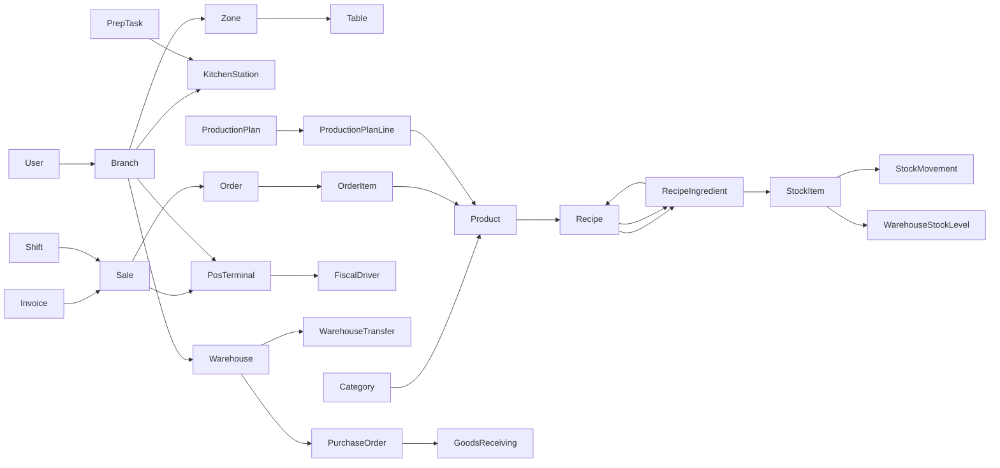

# 🗺️ Ramis ERP — Bilgi Grafiği (Knowledge Graph)

> **Özet:** Ramis ERP, restoran ve kafeler için geliştirilmiş kurumsal kaynak planlama sistemidir. Django 6 (Backend) + Next.js 16 (Frontend) mimarisi üzerinde çalışır.
> **Son INGEST:** 2026-08-22 — **Mimari inceleme düzeltmeleri (offline-güvenli, cerrahi):** Tekil `complete_order`/`cancel_order`/`force_close` masa complete ile aynı `select_for_update(nowait=True)` kilidi; `commit_reservations` rezerv satır kilidi; `return_sale` kilit; satır kilidi `ROW_LOCKED` 409. Fiscal Cloud webhook: fail-closed serial/client, opsiyonel `webhook_secret`, Anon throttle. `OrderViewSet`/`OrderItemViewSet` `is_active=True`. Logout `clearTokenCache`. Edge `PUBLIC_PATHS`: `/pos/display`, `/serwist`. Depo WS `warehouseNotificationsHubKey` (sidebar+sayfa tek TCP). `db.sqlite3` gitignore. Güncellenen: [[Index]], [[Orders]], [[Inventory]], [[Sales]], [[Fiscal_Integration]], [[API_Responses]], [[Auth_Flow]], [[API_Client]], [[Frontend_Architecture]], [[Frontend_WebSocket]], [[WebSocket_Architecture]], [[PWA]], [[POS_Display]].

> **Önceki INGEST:** 2026-07-08 — **Smart Table Performans Optimizasyonu (Seviye C)**: Menü verisi normalizasyonu (`useMenuNormalized`), cart derived state, useShallow selector birleştirme, useOrderSync WS useRef stabilizasyonu. FlatList getItemLayout, CategoryRow FlatList geçişi, CartSheet 4 parçaya bölme + lazy load, ProductCard recyclingKey, inline style memo. Hermes `-O` flag, metro agresif minifier, usePerformanceMark hook. 10 commit, 22 dosya, `perf/smart-table-optimization` branch. Güncellenen: [[Smart_Table]], [[Index]].

> **Önceki INGEST:** 2026-07-08 — **Async PDF Export + Performans Optimizasyonları**: 23 modül raporu ve fatura PDF üretimi Celery `pdf_export` kuyruğuna taşındı. `ModuleReportViewSet` `?async=true` + `/export-status/` polling. `InvoiceService.create_invoice()` → `transaction.on_commit()` async PDF. Frontend `AsyncPdfExportButton` 18 bileşene entegre edildi. `BaseModel.is_active`/`created_at` + `Table`/`Zone` composite indexler. `MenuCatalogPagination` page_size 500→100. Güncellenen: [[Index]], [[Reporting]], [[Invoices]], [[Celery_Tasks]], [[Async_PDF_Export]], [[BaseModel]], [[Branches]].

> **INGEST:** 2026-07-07 — **KDS birleşik ürün + Smart Firing menü zamanlaması**: KDSde birleşik menülerin sol panel (`KdsOrderTotalsPanel`) ve sipariş kartı (`OrderCard`) hiyerarşik gösterimi; `KDSSlimOrderItemSerializer` üzerinden `combined_parent_*` alanları. Smart Firingde parent reçetesiz menülerde alt bileşen reçete sürelerinin toplanması, reçete/süre yoksa hemen gönder (`firing_state: late`). Güncellenen: [[Index]], [[Frontend_KDS]], [[Smart_Firing_v2]], [[Orders]].

---

## 🏗️ Mimari Genel Bakış

- [[Mimari_Genel_Bakis]] — Proje katmanları, teknoloji yığını ve veri akışı
- [[Tech_Stack]] — Kullanılan tüm teknolojiler ve kütüphaneler
- [[Deployment]] — Docker, systemd, Nginx ve kurulum altyapısı
- [[ASGI_Split_Deploy]] — Uvicorn (HTTP) + Daphne (WS) ayrıştırması, nginx upstream, PG bağlantı stratejisi
- [[Runtime_Config]] — IP değişiminde rebuild gerektirmeyen API URL + özellik bayrakları
- [[Backend_Environment]] — `/etc/ramis/backend.env` tam referansı ve ölçeklendirme
- [[Frontend_Environment]] — `/etc/ramis/frontend.env` ve `NEXT_PUBLIC_*` rehberi
- [[Load_Testing]] — Locust peak hour kapasite testi ve env anahtarları
- [[Standalone_Deploy]] — Next.js `output: standalone` modu, systemd birimi ve taşıma adımları
- [[Health_Endpoint]] — Kimlik doğrulamasız sağlık kontrolü (`/api/v1/health/`) ve WS metrik izleme

---

## ⚙️ Backend (Django)

### Çekirdek (Core)
- [[BaseModel]] — UUID tabanlı soft-delete temel modeli
- [[Branch_Scope]] — Şube bazlı veri izolasyonu ve güvenlik katmanı
- [[RBAC]] — Rol tabanlı erişim kontrolü sistemi (hiyerarşi, cache, DRF signals/middleware)
- [[Auth_Flow]] — JWT kimlik doğrulama ve cookie tabanlı oturum yönetimi
- [[Django_Settings]] — Proje yapılandırması ve ortam değişkenleri
- [[Celery_Tasks]] — Arka plan görev yönetimi
- [[Celery_Beat_Sync]] — Beat zamanlayıcı DB senkronizasyonu ve görev seçenek presetleri
- [[Async_PDF_Export]] — Modül raporları ve fatura PDF'lerinin Celery tabanlı asenkron üretimi
- [[Audit_Trail]] — Merkezi denetim logu ve operasyonel kanıt sistemi
- [[API_Responses]] — Standart DRF hata/başarı yanıt sözleşmesi
- [[Core_Utilities]] — JSON serileştirme, Redis URL, çeviri bağlamı, ondalık sabitler, miktar gösterim biçimlendirme (`quantity_format`)
- [[Management_Commands]] — seed_full, register_permissions, rbac_manage, sync_celery_beat

### Uygulama Modülleri
- [[Users]] — Kullanıcı modeli ve yönetimi
- [[Branches]] — Şube, bölge, masa ve istasyon yönetimi
- [[Menu]] — Ürün, kategori, varyant ve modifier sistemi; yanında önerilen ürünler: [[Menu_Product_Recommendations]]; dönemsel menü etiketleri: [[Menu_Tags]]
- [[Customers]] — Bireysel ve kurumsal müşteri yönetimi, raporlama ve POS entegrasyonu
- [[Orders]] — Sipariş akışı ve sipariş kalemleri; Smart Firing v1/v2 zamanlama ([[Smart_Firing_v2]])
- [[Smart_Firing_v2]] — İstasyon kuyruğu, EMA süreleri, KDS/POS entegrasyonu (bayraklı)
- [[Sales]] — Satış ve ödeme yönetimi (CASH / CARD / OTHER / CREDIT)
- [[Fiscal_Integration]] — Türkiye yasal mevzuatına uygun modüler yazar kasa ve mali entegrasyon altyapısı
- [[Fiscal_Integration_Production]] — Beko / Token X-Connect Cloud üretim ortamı kurulum rehberi (prod checklist)
- [[Credit]] — Ödenmez (müşteri kredisi) hesapları ve POS entegrasyonu
- [[Inventory]] — Stok kalemleri, hareketler, tedarikçiler, lot (FEFO) takibi, allerjen ataması (EPIC-04); alış fiyatı artışı API; gün sonu kapanış: [[Kitchen_Closing]]; iptal/iade: [[Stock_Return_Cancel]]
- [[Kitchen_Closing]] — Gün sonu mutfak sayımı, otomatik fire kaydı ve miktar gösterim kuralları
- [[Stock_Return_Cancel]] — Depo stok iptal/iade (RETURN/CANCEL hareketleri, KDS, raporlama)
- [[Allergens]] — Allerjen referans kataloğu, reçete birleşimi ve POS uyarıları (FAZ 1)
- [[Warehouse]] — Depo yönetimi, satın alma, mal kabul, transfer, sayım ve SKT operasyon ekranı; akıllı satın alma: [[Procurement_Intelligence]]
- [[Procurement_Intelligence]] — Ufuk günü satın alma önerisi, geciken PO uyarıları, fiyat artışı takibi (EPIC genişletmesi)
- [[Recipes]] — Reçete / tarif yönetimi ve maliyet hesaplama
- [[Shifts]] — Vardiya, kasa hareketleri ve gider yönetimi
- [[Invoices]] — Fatura oluşturma ve Celery tabanlı async PDF üretimi ([[Async_PDF_Export]])
- [[Reservations]] — Masa rezervasyon sistemi
- [[Reservation_Alerts]] — Rezervasyon saati ve misafir geldi bildirimleri (POS / garson / mobil)
- [[POS_Display]] — Müşteri ekranı, POS terminalleri ve tanıtım slaytları
- [[POS_Connected_Users]] — Bağlı cihaz oturumları listesi ve yönetimi (`pos.manage_connections`)
- [[Guest_Feedback]] — Müşteri geri bildirim anketleri, soru tipleri, anket oturumu takibi ve WebSocket yayını
- [[Production_Planning]] — Günlük üretim planlaması ve 86 listesi
- [[Prep]] — Mutfak hazırlık görevleri, şablonlar ve akıllı kurallar
- [[Prep_Display]] — İstasyon hazırlık kiosk oturumu, imzalı display token ve token tabanlı görev akışı
- [[Performances]] — Garson çağrı geçmişi, yanıt süreleri ve performans analitiği
- [[Printing]] — ESC/POS yazıcı yönetimi; mutfak yazıcıları istasyon + fiş şablonu ile eşleştirilir, sipariş baskısı istasyon bazlı yönlendirilir
- [[Reporting]] — Çift katmanlı raporlama: HTML/PDF modül raporu altyapısı (6 modül bağımlı) + ESC/POS fiş şablonu sistemi ([[ReceiptTemplate]]) — yeni `branch_logo`, `branch_info` blok tipleri
- [[ReceiptTemplate]] — ESC/POS blok şeması, renderer ve `hide_if_empty` / `tax | rate X` davranışları
- [[Search]] — Genel arama servisi
- [[Dashboard]] — Yönetim paneli verileri; menü kârlılığı ve variance drilldown: [[Menu_Engineering]]

### WebSocket Kanalları
- [[WebSocket_Architecture]] — Gerçek zamanlı iletişim altyapısı (Channels, Redis, Daphne)
- [[WS_Internals]] — Ertelenmiş yayın birleştirme, throttle, in-memory metrikler, consumer yardımcıları
- [[Waiter_Call_Dismiss]] — Garson çağrısı görüldü senkronu (tüm istemciler)

---

## 🎨 Frontend (Next.js)

### Temel Yapı
- [[Frontend_Architecture]] — Next.js App Router, layout ve provider yapısı
- [[Design_System_v2]] — Design Tokens, Multi-theme & Density
- [[State_Management]] — Zustand store'ları (Frontend + Smart Table)
- [[API_Client]] — Axios interceptor'lar ve token yenileme akışı
- [[UI_Components]] — Shadcn/ui bileşen kütüphanesi
- [[PWA]] — Serwist ile Progressive Web App desteği
- [[Internationalization]] — next-intl ile çoklu dil yönetimi (TR/EN)

### Altyapı & Yardımcılar
- [[Frontend_Hooks]] — 8 özel React hook (useBranchContext, useIdempotency, useCleaningCountdown vb.)
- [[Frontend_RBAC]] — İstemci tarafı izin sistemi, AuthGuard bileşeni, 18 modül izin grubu
- [[Frontend_Formatters]] — Merkezi biçimlendirme (para, miktar, birim dönüşümü, izin maskeleme)
- [[Frontend_Error_Handling]] — API hata ayrıştırma, operasyonel toast, HttpError sınıfı
- [[Frontend_WebSocket]] — ManagedWebSocket, SharedWebSocketHub, auth WS URL oluşturucular
- [[Frontend_Backend_Health]] — Sunucu sağlık izleme (provider, indicator, banner)
- [[Frontend_Receipt_Renderer]] — İstemci taraflı ESC/POS fiş renderer (önizleme)
- [[Frontend_Search]] — Global arama (⌘K): menü navigasyonu + varlık araması, RBAC, i18n grup etiketleri

### Özellik Modülleri (Frontend Features)
- [[Frontend_Modules]] — Tüm frontend modülleri toplu referans
- [[Frontend_Dashboard]] — Restoran özeti (`/dashboard`)
- [[Frontend_Tables]] — Masa yönetimi (`/tables`); `TableOrderModal` manuel fiş yeniden baskısı (mutfak + sipariş)
- [[Frontend_POS]] — POS satış ekranı ([[Smart_Firing_v2]] yoğunluk toast)
- [[POS_Offline_Queue]] — Çevrimdışı sipariş/ödeme kuyruğu + idempotent senkron (EPIC-07)
- [[GateHomeButton]] — Vardiya/POS kapı ekranlarında `/panel` dönüş düğmesi
- [[Frontend_KDS]] — Mutfak gösterim sistemi ([[Smart_Firing_v2]] firing UI, geri çağır drawer)
- [[Frontend_Inventory]] — Stok yönetim ekranları (FEFO raporu; tedarikçi performans + gecikmiş PO; SKT widget → depo)
- [[Frontend_Allergens]] — Allerjen referans ekranı (`/allergens`)
- [[Frontend_Warehouse]] — Depo yönetim ekranları (SKT Takibi, satın alma önerileri/ufuk, geciken PO, fiyat artışları, gün sonu kapanış, fire raporları; EPIC-04); iptal/iade sekmesi: [[Stock_Return_Cancel]]
- [[Frontend_Menu]] — Menü düzenleme; etiket yönetimi: [[Menu_Tags]]
- [[Frontend_Admin]] — Kullanıcı ve yetki yönetimi
- [[Frontend_Users]] — Kullanıcı CRUD, profil, şifre değiştirme
- [[Frontend_Branches]] — Şube seçimi ve kullanıcı-şube atama
- [[Frontend_Credit]] — Ödenmez hesap yönetimi (`/credit`)
- [[Frontend_Shifts]] — Vardiya ekranları
- [[Frontend_Reservations]] — Rezervasyon ekranları
- [[Frontend_Sales]] — Satış raporları, ürün analizi, iptaller/iadeler, Menü Mühendisliği; satış detayında yazıcı seçimli fiş baskısı
- [[Frontend_Performances]] — Performans Yönetimi; garson çağrı analitiği (`/performances`)
- [[Frontend_Invoices]] — Fatura ekranları
- [[Frontend_Recipes]] — Reçete ekranları
- [[Frontend_Prep]] — Hazırlık yönetim ekranları
- [[Frontend_Production_Planning]] — Üretim planlaması ekranları
- [[Frontend_Waiter]] — Garson sipariş ekranı
- [[Frontend_Surveys]] — Yönetim panelindeki anket sekmesi, anket yanıt analizleri, müşteri ekranındaki anket gösterimi ve WebSocket senkronizasyonu
- [[ReceiptDesignerTab]] — ESC/POS fiş şablonu tasarımcısı (blok editörü + termal önizleme)
- [[Recycle_Bin]] — Soft-delete geri dönüşüm kutusu (süper kullanıcı)

---

## 📱 Mobil Uygulamalar

- [[Mobile_Apps_Family]] — Üç mobil uygulamanın (waiter, smart_table, stock_man) karşılaştırması ve paylaşılan desenleri
- [[Mobile_Waiter_App]] — Garsonlar için React Native tabanlı sipariş alma uygulaması (`mobile_app/waiter/`)
- [[Smart_Table]] — Masaüstü tabletler için React Native self-servis menü/sipariş uygulaması (`mobile_app/smart_table/`)
- [[Stock_Man_App]] — Depo ve satınalma operasyonları için tablet-öncelikli React Native uygulaması (`mobile_app/stock_man/`, 4 dil, çevrimdışı kuyruk, barkod/yazıcı); iptal/iade sekmesi: [[Stock_Return_Cancel]]

---

## 🖥️ Masaüstü Uygulamaları (Electron)

- [[Electron_KDS]] — KDS (Mutfak Gösterim Sistemi) bağımsız Electron uygulaması ve otomatik oturum yönetimi
- [[Electron_POS]] — POS (Satış Noktası) Electron uygulaması, çoklu monitör müşteri ekranı ve görsel vekil sunucusu desteği
- [[Electron_KDS_Prep_Window]] — İstasyon hazırlık ekranı için bağımsız Electron kiosk (server setup + station session)

---

## 🛠️ Sistem Araçları

- [[Ramis_Monitor]] — GTK4 tabanlı servis izleyici uygulaması
- [[Backup_Restore]] — PostgreSQL yedekleme ve geri yükleme aracı
- [[User_Emergency_Admin]] — GTK4 acil kullanıcı yönetimi (yumuşak silme, parola, süper kullanıcı; `pkexec`)
- [[DB_Maintenance]] — GTK4 tabanlı PostgreSQL bakım uygulaması (VACUUM, REINDEX, ANALYZE)

---

## 📊 Veri İlişkileri

