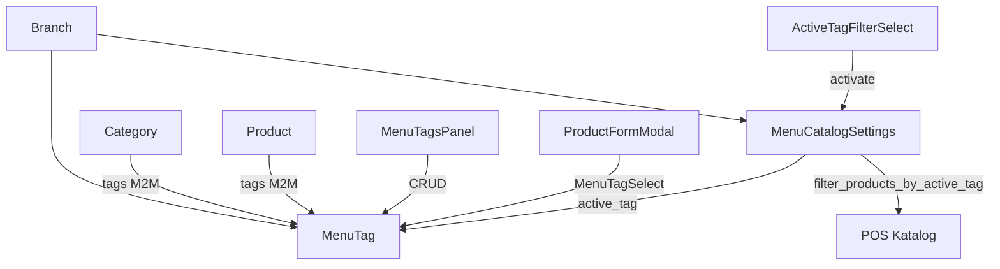

# Menu Tags (Menü Etiketleri)

> **Özet:** Şubeye özel menü etiketleri (`#yaz_menusu` vb.) ile ürün ve kategoriler etiketlenir; **Aktif Menü** seçimi POS katalog görünürlüğünü dönemsel menü değişimine göre filtreler. Etiket CRUD menü yönetiminde ayrı sekmede; ürün/kategori formlarında yalnızca seçim yapılır.
> **Kütüphaneler:** Django ORM, DRF, React, next-intl, Zustand (`usePosStore` — WS senkronu)
> **Bağlantılar:** [[Menu]], [[Frontend_Menu]], [[Branch_Scope]], [[BaseModel]], [[WebSocket_Architecture]], [[Frontend_POS]], [[Internationalization]]

---

## Konum

| Katman | Yol |
|--------|-----|
| Modeller | `backend/apps/menu/models.py` → `MenuTag`, `MenuCatalogSettings` |
| Filtre servisi | `backend/apps/menu/menu_tag_service.py` |
| API | `backend/apps/menu/views.py` → `MenuTagViewSet`, `MenuCatalogSettingsViewSet` |
| Serializer | `backend/apps/menu/serializers.py` → `MenuTagSerializer`, `MenuTagBriefSerializer`, `CategorySerializer.tags`, `ProductSerializer.tags` |
| URL | `backend/apps/menu/urls.py` → `tags`, `catalog-settings` |
| Migrasyon | `0027_menu_tags.py`, `0028_menutag_branch_scope.py` |
| Test | `backend/apps/menu/tests/test_menu_tags.py` |
| Menü UI — sekme | `frontend/src/app/menu-management/page.tsx` → `menuTags` |
| Menü UI — bileşenler | `MenuTagsPanel.tsx`, `MenuTagFormModal.tsx`, `MenuTagSelect.tsx`, `ActiveTagFilterSelect.tsx`, `CategoryPanel.tsx` |
| Hook'lar | `useMenuTagsManagement.ts`, `useMenuData.ts` |
| İstemci filtre | `frontend/src/features/menu/lib/menuTagFilter.ts` |
| API istemcisi | `frontend/src/features/menu/services/menuApi.ts` |
| Tipler | `frontend/src/features/menu/types/index.ts` → `MenuTag`, `MenuCatalogSettings` |
| POS WS | `frontend/src/features/pos/hooks/useMenuCatalogSync.ts` |

---

## Backend modelleri

### MenuTag (`[[BaseModel]]` — soft delete)

| Alan | Tip | Açıklama |
|------|-----|----------|
| `branch` | `FK → Branch` | Etiket şubeye özeldir |
| `name` | `CharField(100)` | `#` öneki `save()` ile otomatik eklenir |

**Kısıt:** `(branch, name)` unique — aynı şubede aynı isimde iki aktif etiket olamaz.

### MenuCatalogSettings

Şube başına tek kayıt (`OneToOneField → Branch`):

| Alan | Tip | Açıklama |
|------|-----|----------|
| `active_tag` | `FK → MenuTag`, null | Seçili etiket filtresi |
| `filter_untagged` | `BooleanField` | `True` → yalnızca etiketsiz kategori/ürünler |

### İlişkiler

- `Category.tags` — `M2M → MenuTag`
- `Product.tags` — `M2M → MenuTag`
- Yazma: serializer `tag_ids` (UUID listesi); okuma: yalnızca `is_active=True` etiketler (`SerializerMethodField`)

---

## API

| Endpoint | İzin | Açıklama |
|----------|------|----------|
| `GET /api/v1/menu/tags/?branch_id=` | `menu.view_product` | Şube etiket listesi |
| `POST /api/v1/menu/tags/` | `menu.manage_product` | `{ name, branch }` |
| `PATCH /api/v1/menu/tags/{id}/` | `menu.manage_product` | Ad güncelleme |
| `DELETE /api/v1/menu/tags/{id}/` | `menu.manage_product` | Soft delete + ilişki temizliği |
| `GET /api/v1/menu/catalog-settings/?branch_id=` | `menu.view_product` | Aktif filtre durumu |
| `POST /api/v1/menu/catalog-settings/` | `menu.manage_product` | Filtre aktivasyonu |

**Katalog ayarı yanıtı:** `branch_id`, `active_tag_id`, `active_tag_name`, `filter_untagged`, `has_tags`.

**Aktivasyon gövdesi örnekleri:**
- Belirli etiket: `{ branch_id, tag_id }`
- Etiketsiz: `{ branch_id, filter_untagged: true }`
- Tümü (filtre kapalı): `{ branch_id }` — `active_tag` ve `filter_untagged` sıfırlanır

**Liste filtreleri (POS / menü yönetimi):**
- `GET /menu/categories/?branch_id=&apply_tag_filter=1` (varsayılan POS)
- `GET /menu/products/?branch_id=&apply_tag_filter=1`
- Menü yönetimi tam listesi: `apply_tag_filter=0`

---

## Filtre mantığı (`menu_tag_service.py`)

`should_apply_tag_filter(branch_id)` — şubede en az bir aktif etiket **ve** katalog ayarında aktif seçim varsa `True`.

### Ürün filtresi (`filter_products_by_active_tag`)

| Mod | Davranış |
|-----|----------|
| Filtre kapalı | Tüm ürünler |
| `filter_untagged` | Şubeye ait etiketi olan ürünler ve etiketli kategori ağacındaki ürünler **hariç** |
| `active_tag` | Yalnızca **doğrudan** o etikete sahip ürünler |

> **Önemli:** Kategori etiketi tek başına alt ürünleri POS'a dahil etmez. Ürünün kendisinde aynı etiket olmalıdır.

### Kategori filtresi (`filter_categories_by_active_tag`)

| Mod | Davranış |
|-----|----------|
| `filter_untagged` | Etiketli kategori ağacı hariç |
| `active_tag` | Etiketli kategoriler + içinde etiketli ürün bulunan kategoriler |

### Etiket silme (`soft_delete_menu_tag`)

1. `Category.tags` ve `Product.tags` M2M satırları silinir
2. Şubede bu etiket aktif filtredeyse `MenuCatalogSettings` sıfırlanır
3. `MenuTag.is_active = False`
4. `broadcast_menu_catalog_refresh("menu_tag_deleted", branch_id=...)`

---

## Frontend — Menü yönetimi

### Sekmeler (`menu-management`)

| Sekme | `page.tabs` anahtarı | İçerik |
|-------|----------------------|--------|
| Menü Etiketleri | `menuTags` | `MenuTagsPanel` — CRUD (Seçenek Grupları düzenine benzer) |

**Hook:** `useMenuTagsManagement(branchId, onTagsChanged)` — etiket listesi ve form durumu.

**Senkron:** `onTagsChanged` → `useMenuData.refreshAfterTagChange()` — kategori/ürün listesi + etiket/filtre verisi birlikte yenilenir.

### Ürün / kategori formları

- `MenuTagSelect` — çoklu seçim; etiket oluşturma/silme **yok** (boş liste → Menü Etiketleri sekmesine yönlendirme metni)
- `mergeTagIdsForBranch` / `filterTagIdsForBranch` — çok şubeli ürünlerde diğer şubelerin etiketleri korunur

### Aktif Menü filtresi (`ProductTable` üst çubuğu)

| Bileşen | Rol |
|---------|-----|
| `ActiveTagFilterSelect` | Tümü / Etiketsiz / etiket seçenekleri |
| Info diyaloğu | `tagFilter.infoParagraph1–4` — dönemsel menü açıklaması |
| Şube seçici | Çok şubede `selectedBranchId` |
| **Tümünü göster** switch | Yönetim panelinde filtre aktifken tüm kayıtları geçici gösterir |

Aktivasyon onayı: `AlertDialog` (`tagFilter.confirmTitle`).

### Kategori paneli

`CategoryPanel` — şubeye göre filtrelenmiş etiketler kategori adının **altında**, alt alta listelenir (`getTagsForBranch`).

### İstemci filtre (`menuTagFilter.ts`)

Menü yönetimi listesi backend filtre mantığını `branch_id` ve `catalogSettings` ile yansıtır; `effectiveMenuActive`, `categoryVisibleInPanel`, `productMatchesActiveTag` yardımcıları POS ile tutarlı davranış sağlar.

---

## WebSocket ve POS

Etiket CRUD veya filtre aktivasyonu sonrası `broadcast_menu_catalog_refresh` yayınlanır.

POS tarafı: `useMenuCatalogSync` → `menu_catalog_refresh` mesajında katalog HTTP yenilemesi ([[Frontend_POS]], [[WebSocket_Architecture]]).

---

## Yetkilendirme

| İşlem | İzin |
|-------|------|
| Etiket listeleme | `menu.view_product` |
| Etiket CRUD + filtre aktivasyonu | `menu.manage_product` |
| Menü Etiketleri sekmesi | `menu.manage_product` |

Şube erişimi: `accessible_branch_id_strings` ([[Branch_Scope]]).

---

## i18n

Namespace: `menu_management` — dört dil (`tr`, `en`, `sq`, `bg`):

| Bölüm | Anahtarlar |
|-------|------------|
| Sekme | `page.tabs.menuTags` |
| Etiket sekmesi | `menuTagsTab.*` |
| Seçici | `menuTags.placeholder`, `menuTags.emptyManageHint` |
| Aktif menü | `tagFilter.activeMenuLabel`, `tagFilter.infoParagraph1–4` |
| Formlar | `categoryForm.tags`, `productForm.tags` |

Bkz: [[Internationalization]].

---

## Test özeti

`apps/menu/tests/test_menu_tags.py` — etiket normalizasyonu, şube izolasyonu, aktivasyon, etiketsiz filtre, kategori-etiket / ürün-etiket POS ayrımı, silme sonrası M2M ve aktif filtre temizliği.

---

## İlişki diyagramı

