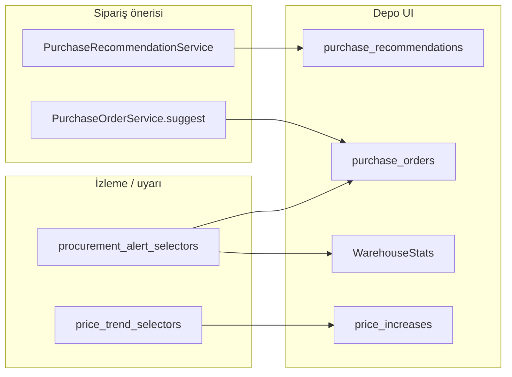

# Procurement Intelligence (Akıllı Satın Alma)

> **Özet:** Depo ve envanter katmanına eklenen karar desteği özellikleri: kısa vadeli tüketim tabanlı satın alma önerisi (ufuk günü), geciken satın alma siparişi uyarıları ve alış fiyatı artışı takibi. Yeni Django uygulaması yok; mevcut [[Warehouse]] ve [[Inventory]] modülleri genişletildi.
> **Kütüphaneler:** Django ORM, Celery, Django Channels, React, TanStack Query
> **Bağlantılar:** [[Warehouse]], [[Frontend_Warehouse]], [[Inventory]], [[Frontend_Inventory]], [[Celery_Tasks]], [[Backend_Environment]], [[WebSocket_Architecture]], [[Production_Planning]]

---

## Konum

| Katman | Yol |
|--------|-----|
| Backend — öneri motoru | `backend/apps/warehouse/services/purchase_recommendation_service.py` |
| Backend — gecikme selector | `backend/apps/warehouse/procurement_alert_selectors.py` |
| Backend — fiyat trend selector | `backend/apps/inventory/price_trend_selectors.py` |
| Backend — Celery | `backend/apps/warehouse/tasks.py` → `scan_overdue_purchase_orders_daily` |
| Frontend — depo sekmeleri | `frontend/src/features/warehouse/components/` |
| Ayar yöneticisi | `system_utils/ramis_settings/settings_schema.py` (`BEAT_SCAN_OVERDUE_PO_TIME`) |

---

## Üç katmanlı mimari

| Özellik | Amaç | PO oluşturur? |
|---------|------|----------------|
| [[Warehouse#Satın Alma Önerileri (EPIC-01)]] | Tüketime göre N günlük ihtiyaç | Evet (commit) |
| PO sekmesi **Otomatik Öner** | Minimum eşiğe tamamlama | Evet (tek adım) |
| Geciken PO uyarıları | Açık sipariş gecikmesi | Hayır |
| Fiyat artışları | Son iki alış fiyatı karşılaştırması | Hayır |

Detaylı karşılaştırma: aşağıdaki bölümler ve [[Frontend_Warehouse#Satın Alma Siparişleri vs Satın Alma Önerileri]].

---

## 1. Kısa vadeli satın alma önerisi (`horizon_days`)

EPIC-01 motorunun genişletmesi. Mevcut 4/8 haftalık OUT+WASTE tüketiminden günlük ortalama çıkarılır; **ufuk günü** (3 / 7 / 14) ve şube güvenlik çarpanı (`[[Production_Planning]]` → `ProductionDaySettings.default_safety_factor`) ile hedef stok hesaplanır.

**Formül:**
- `günlük_ort = haftalık_ort / 7`
- `hedef = günlük_ort × horizon_days × güvenlik_çarpanı`
- `önerilen = max(hedef − (mevcut + yoldaki), minimum_gap)`

**Ek API alanları:** `horizon_days`, `daily_average_consumption`, `estimated_days_until_stockout`, `urgency` (`critical` | `warning` | `ok`)

**API:**
- `GET /api/v1/warehouse/purchase-recommendations/?warehouse_id=&weeks=4|8&horizon_days=3|7|14`
- `POST /api/v1/warehouse/purchase-recommendations/commit/` (değişmedi)

**Yetki:** `warehouse.view_purchase_recommendation`, `warehouse.commit_purchase_recommendation`

**UI:** [[Frontend_Warehouse]] — sekme `purchase_recommendations`; `PurchaseRecommendationsTab`, `PurchaseRecommendationsTable`

---

## 2. Geciken satın alma siparişi uyarıları

Beklenen teslimat tarihi (`PurchaseOrder.expected_date`) geçmiş, durumu `ORDERED` veya `PARTIALLY_RECEIVED` olan siparişler.

**Backend:**
- `get_overdue_purchase_orders()` — liste
- `get_supplier_delivery_alerts()` — tedarikçi bazında gruplama + `severity`
- `GET /api/v1/warehouse/procurement-alerts/?branch_id=&warehouse_id=&supplier_id=`
- `GET /api/v1/warehouse/purchase-orders/?overdue=true`
- Depo özeti: `overdue_orders` sayacı (`get_all_warehouses_summary`)

**Yetki:** `warehouse.view_purchase_order` (yeni izin yok)

**UI dağılımı (hatırlatıcı tasarım):**
1. [[Frontend_Warehouse]] özet — `WarehouseStats` geciken sipariş kartı → PO sekmesi
2. `PurchaseOrdersTab` — amber banner + geciken filtresi
3. [[Frontend_Inventory]] — `SupplierPerformanceModal` altında gecikmiş açık PO listesi (`warehouseApi.getProcurementAlerts`)

**WebSocket:** `procurement.overdue_alert` → `procurement_overdue_alert` ([[WebSocket_Architecture]])

**Gece taraması:** `scan_overdue_purchase_orders_daily` — bkz. [[Celery_Tasks#scan_overdue_purchase_orders_daily]]

**Env:** `BEAT_SCAN_OVERDUE_PO_HOUR` (vars. `5`), `BEAT_SCAN_OVERDUE_PO_MINUTE` (vars. `0`) — [[Backend_Environment#10. Celery Beat zamanlamaları]], Ramis Ayar Yöneticisi Beat sekmesi

---

## 3. Fiyat artışı takibi

Son iki IN (`StockMovement`) hareketinin `unit_price` değerleri karşılaştırılır; eşik üstü artışlar listelenir. v1'de yeni model yok.

**API:**
- `GET /api/v1/inventory/stock-items/price-increases/?branch_id=&min_change_pct=5&lookback_days=90&category_id=`

**Yanıt alanları:** `stock_item_id`, `name`, `sku`, `previous_price`, `current_price`, `change_pct`, `last_purchase_date`, `supplier_name`, `summary`

**Yetki:** `inventory.view_stock_item`; tutarlar `useCanViewAmounts` ile maskelenir

**UI:** [[Frontend_Warehouse]] — sekme `price_increases`; `PriceIncreasesTab` (satıra tıklayınca `CostHistoryModal`)

---

## Otomatik Öner vs Satın Alma Önerileri

| | **PO → Otomatik Öner** | **Satın Alma Önerileri sekmesi** |
|---|---|---|
| Tetikleyici | PO sekmesi butonu | Ayrı sekme, sürekli liste |
| Veri | Anlık `quantity < minimum` | 4/8 hafta OUT+WASTE tüketimi |
| Yoldaki PO | Hesaba katmaz | Düşer |
| Ufuk | Yok (minimuma tamamla) | 3 / 7 / 14 gün |
| Çıktı | Taslak PO (tek adım) | Seçili satırlar → commit → taslak PO |

İkisi de sipariş üretir; **Procurement Intelligence** katmanı (gecikme + fiyat) sipariş üretmez, mevcut siparişleri ve maliyeti izler.

---

## Testler

| Dosya | Kapsam |
|-------|--------|
| `backend/apps/warehouse/tests/test_purchase_recommendations.py` | `horizon_days`, stockout, urgency |
| `backend/apps/warehouse/tests/test_procurement_alerts.py` | Geciken PO, özet sayacı, `overdue` filtresi |
| `backend/apps/inventory/tests/test_price_trends.py` | Fiyat artışı eşiği |

---

## Bilinçli kapsam dışı

- Alternatif tedarikçi önerileri
- Ayrı `procurement` Django uygulaması
- Mobil `stock_man` (web API hazır; UI sonraki faz)
- Satış tahmini → reçete patlatması ile öneri birleştirme (opsiyonel Faz 2)
